# Security Asset Inventory & Vulnerability Management Platform
## Solution Architecture Document

**Version:** 1.0  
**Date:** 2026-08-25  
**Status:** Initial Proposal  
**Classification:** Internal – Confidential  

---

# PART A – Executive Summary

## Product Overview

This document proposes **SecPlatform** — an internal Security Asset Inventory & Vulnerability Management Platform designed to become the centralized source of truth for the Security Team's operational data.

The platform addresses a critical operational gap: security-relevant information is currently fragmented across Excel spreadsheets, multiple Jira projects, manual records, and tribal knowledge. This fragmentation makes it impossible to reliably answer fundamental questions: *Which applications have been assessed? Which vulnerabilities are open? Are we meeting our SLAs?*

## Recommended Architecture

**Modular Monolith** built with:

- **Frontend:** Next.js (React) with TypeScript
- **Backend:** Node.js / Next.js API Routes + dedicated service layer, TypeScript
- **Database:** PostgreSQL with pgvector extension
- **Cache/Queue:** Redis (caching + job queue via BullMQ)
- **Search:** PostgreSQL full-text search (MVP), OpenSearch later if needed
- **AI:** LLM Gateway pattern with Claude API, embeddings via dedicated service
- **Auth:** Corporate SSO via OIDC
- **Observability:** Structured JSON logging, Prometheus metrics, OpenTelemetry tracing

The system is organized into **seven bounded modules**:

1. **Asset Management** — Application inventory, Excel import, reconciliation
2. **Assessment Management** — Security assessment tracking, workflow
3. **Vulnerability Management** — Finding tracking, lifecycle, SLA
4. **Integration Engine** — Adapter-based external system connectivity (Jira first)
5. **Intelligence Engine** — AI capabilities, entity resolution, NLQ, recommendations
6. **Operations Console** — Dashboards, search, notifications, reporting
7. **Platform Services** — Auth, RBAC, audit, configuration, administration

## Key Design Decisions

| Decision | Recommendation | Rationale |
|----------|---------------|-----------|
| Architecture | Modular Monolith | Small team, single deployment, clear module boundaries |
| Database | PostgreSQL + pgvector | Relational integrity + vector search in one DB |
| API | REST | Simpler, sufficient for internal app, better tooling |
| Jira Sync | Hybrid (Polling + Webhooks) | Reliable baseline + real-time updates |
| Search | PostgreSQL FTS (MVP) | Avoid operational overhead; migrate later |
| AI | LLM Gateway + Claude | Best reasoning for entity resolution; gateway enables future model switching |
| Business Rules | Configurable rule engine | SLA, workflow, and mapping rules change without code |

## MVP Scope

The MVP delivers the core data foundation and primary workflows:

1. Application Inventory with Excel import/reconciliation
2. Jira synchronization for assessments and vulnerabilities
3. Application-to-ticket mapping with AI assistance
4. Application 360-degree security view
5. Basic dashboards (executive + operational)
6. SLA calculation and breach alerting
7. Basic AI ticket analysis and NLQ
8. RBAC, audit logging, notifications

**Estimated MVP timeline:** 12–16 weeks with a team of 3–5 engineers.

---

# PART B – Assumptions

The following assumptions are made in the absence of confirmed information. Each is labeled for review.

### Business & Organization

| ID | Assumption | Impact if Wrong |
|----|-----------|----------------|
| A1 | The Security Team has 10–30 members | Affects workload features, scale |
| A2 | 500–2,000 applications exist in the inventory | Affects import/search design |
| A3 | Jira Cloud is used (not Jira Server/Data Center) | API differences, webhook availability |
| A4 | One primary Jira project for assessments, one for vulnerabilities | Multi-project support needed otherwise |
| A5 | Corporate SSO is available via OIDC or SAML 2.0 | Custom auth fallback needed otherwise |
| A6 | English is the primary language | i18n not in MVP scope |
| A7 | The platform will be hosted on internal infrastructure or private cloud | Affects deployment architecture |
| A8 | Excel files follow a reasonably consistent schema across uploads | Variable schemas need more complex parsing |
| A9 | Users have basic browser access; no offline requirement | PWA/offline not needed |
| A10 | The Security Team currently uses severity levels: Critical, High, Medium, Low | Affects SLA engine design |

### Technical

| ID | Assumption | Impact if Wrong |
|----|-----------|----------------|
| T1 | PostgreSQL 15+ is available in the deployment environment | pgvector, JSON operations depend on version |
| T2 | Redis is available or can be provisioned | Need alternative queue/cache |
| T3 | Outbound HTTPS to Jira and LLM APIs is permitted | Integration blocked otherwise |
| T4 | The team has TypeScript/React experience | Technology stack change needed |
| T5 | CI/CD pipeline exists or can be established | Affects deployment automation |
| T6 | The LLM provider (Claude API) allows enterprise data processing under existing agreements | Legal/procurement dependency |
| T7 | Jira API tokens or OAuth 2.0 credentials can be obtained | Integration blocked otherwise |
| T8 | The Excel inventory file is .xlsx format | Different parsers needed for .xls, .csv |
| T9 | File uploads are under 50MB | Large file handling not designed for |
| T10 | DNS/TLS certificates can be provisioned for internal hosting | Deployment dependency |

### Data

| ID | Assumption | Impact if Wrong |
|----|-----------|----------------|
| D1 | Applications have a stable unique identifier (Application ID or CMDB ID) | Identity resolution becomes harder |
| D2 | Jira tickets contain at least partial application references in summary, description, labels, or custom fields | Mapping accuracy reduced |
| D3 | Historical Jira data is available via API (not purged) | Historical analytics limited |
| D4 | Vulnerability severity is consistently set in Jira | SLA calculation requires manual cleanup |
| D5 | Assessment types can be derived from Jira issue type, labels, or custom fields | Manual classification needed |

---

# PART C – Product Vision

## Vision Statement

*"One platform to know the security posture of every application — what was assessed, what was found, what remains open, and what needs attention next."*

## Problem Statement

The Security Team cannot efficiently answer critical questions about application security because information is scattered across disconnected systems. This leads to:

- **Assessment gaps** — Applications may go years without review with no automated detection
- **Vulnerability blind spots** — Open findings are lost across Jira backlogs
- **SLA violations** — Breaches are discovered manually, often too late
- **Reporting burden** — Every management report requires hours of manual data aggregation
- **Inconsistent data** — The same application is referenced by different names across systems
- **Workload imbalance** — No visibility into engineer capacity and distribution
- **Audit risk** — Inability to demonstrate assessment coverage or remediation timelines

## Product Principles

1. **Single Source of Truth** — The platform is authoritative for application security posture
2. **Data Quality First** — Identity resolution and reconciliation are core capabilities, not afterthoughts
3. **History Matters** — Every state change is preserved for trend analysis and audit
4. **AI Augments, Humans Decide** — AI recommends; humans approve sensitive actions
5. **Integration Independence** — The domain model is not coupled to any external system
6. **Progressive Enhancement** — Start simple, evolve based on real usage
7. **Security of Security** — The platform must itself meet enterprise security standards

## Business Outcomes

| Outcome | Metric | Target |
|---------|--------|--------|
| Complete asset visibility | % of applications in inventory | 100% |
| Assessment coverage | % of applications with current assessment | Tracked, target set by management |
| Vulnerability SLA compliance | % of findings resolved within SLA | Measured and trending upward |
| Reporting efficiency | Time to produce management report | < 5 minutes (from hours) |
| Data consistency | % of Jira tickets linked to correct application | > 95% |
| Operational awareness | Time to identify overdue assessments | Real-time (from days/weeks) |

## Personas (Summary)

| Persona | Primary Goal |
|---------|-------------|
| Security Manager | Understand team workload, assessment coverage, vulnerability trends |
| Security Engineer | Efficiently manage assigned assessments and track findings |
| Security Administrator | Maintain platform configuration, imports, integrations |
| Application Owner | Understand security posture of owned applications |
| Developer | View vulnerabilities assigned for remediation |
| Executive (CISO) | High-level risk posture and compliance metrics |
| Auditor | Verify assessment coverage and remediation evidence |
| System Administrator | Manage users, roles, system health |

---

# PART D – Domain Analysis

## Core Domain Entities

The business domain centers on three primary entities and their relationships:

### Application (Asset)

The fundamental unit of the security inventory. Represents any technology asset that requires security oversight — applications, services, APIs, platforms, infrastructure components.

**Key characteristics:**
- Has a stable identity (Application ID)
- Owned by people and teams
- Has a criticality rating that affects SLA calculations
- May have multiple environments (production, staging, etc.)
- May be known by multiple names (aliases)
- Is the anchor point for all security activities

### Security Assessment

A security review activity performed against one or more applications. Assessments have a lifecycle (requested → completed) and produce findings.

**Key characteristics:**
- Has a type (Go-Live, Periodic, Pen Test, etc.)
- Is typically tracked in Jira but owned internally
- Has SLA requirements
- May cover multiple applications (e.g., a platform assessment)
- Produces vulnerabilities/findings

### Vulnerability (Security Finding)

A security issue discovered through an assessment, scanning tool, or other source.

**Key characteristics:**
- Has severity and SLA
- Belongs to one or more applications
- May originate from an assessment
- Has a lifecycle (new → resolved)
- May require risk acceptance
- Must be verifiable

## Relationship Analysis

### Application → Assessment

**Cardinality:** Many-to-Many

**Rationale:** An application undergoes multiple assessments over time (one-to-many is obvious). But a single assessment can also cover multiple applications — for example, a platform assessment covering an API gateway, its backend services, and shared authentication. A junction table `assessment_application` is required.

**MVP recommendation:** Implement M:N from the start. The junction table is trivial to add and avoids painful migration later. Most assessments will link to one application, but the model must not prevent multi-application assessments.

### Assessment → Vulnerability

**Cardinality:** One-to-Many (MVP), Many-to-Many (Phase 2)

**Rationale:** An assessment produces many vulnerabilities (obvious). A vulnerability is typically discovered in one assessment. However, the same root-cause vulnerability *could* be flagged in multiple assessments — e.g., a shared library vulnerability found in both a code review and a pen test. For MVP, treating this as 1:N with a `source_assessment_id` is sufficient. If duplicate-finding linking is needed, add a `vulnerability_assessment` junction table in Phase 2.

### Application → Vulnerability

**Cardinality:** Many-to-Many

**Rationale:** A vulnerability clearly belongs to at least one application. But a shared-component vulnerability (e.g., a vulnerable library used by 10 services) affects multiple applications. This M:N relationship is important for accurate risk reporting.

**MVP recommendation:** Implement M:N from the start via `vulnerability_application`. Default behavior: a vulnerability links to one application. The UI supports adding additional affected applications.

### Domain Relationship Diagram

```
┌──────────────┐       M:N        ┌──────────────────┐       1:N (MVP)     ┌───────────────┐
│              │◄────────────────►│                  │─────────────────────►│               │
│  Application │                  │    Assessment    │                      │ Vulnerability │
│              │◄─────────────────│                  │                      │               │
└──────┬───────┘    M:N           └──────────────────┘                      └───────┬───────┘
       │                                                                           │
       │                              M:N                                          │
       └───────────────────────────────────────────────────────────────────────────┘
```

### Supporting Entities

- **External Issue (Jira Issue)** — Raw synchronized data from Jira, decoupled from internal domain entities
- **Application Alias** — Known alternative names for an application
- **Application Mapping** — Resolved link between an external reference and an internal application, with confidence and evidence
- **SLA Rule** — Configurable business rules for due-date calculation
- **Risk Acceptance** — Formal acceptance of a vulnerability with expiration
- **Audit Log** — Immutable record of all significant actions

## Bounded Contexts

```
┌─────────────────────────────────────────────────────────────────┐
│                      SecPlatform Domain                         │
│                                                                 │
│  ┌──────────────┐  ┌──────────────┐  ┌───────────────────────┐ │
│  │    Asset      │  │  Assessment  │  │    Vulnerability      │ │
│  │  Management   │  │  Management  │  │    Management         │ │
│  │              │  │              │  │                       │ │
│  │ Application  │  │ Assessment   │  │ Vulnerability         │ │
│  │ Alias        │  │ AssessType   │  │ VulnStatusHistory     │ │
│  │ Owner        │  │ StatusHist   │  │ RiskAcceptance        │ │
│  │ Environment  │  │              │  │                       │ │
│  └──────────────┘  └──────────────┘  └───────────────────────┘ │
│                                                                 │
│  ┌──────────────┐  ┌──────────────┐  ┌───────────────────────┐ │
│  │ Integration  │  │ Intelligence │  │    Platform           │ │
│  │   Engine     │  │   Engine     │  │    Services           │ │
│  │              │  │              │  │                       │ │
│  │ ExternalIssue│  │ AIRequest    │  │ User / Role           │ │
│  │ JiraAdapter  │  │ Embedding    │  │ AuditLog              │ │
│  │ SyncHistory  │  │ AppMapping   │  │ Notification          │ │
│  │ ImportJob    │  │ NLQuery      │  │ Configuration         │ │
│  └──────────────┘  └──────────────┘  └───────────────────────┘ │
└─────────────────────────────────────────────────────────────────┘
```

---

# PART E – Functional Requirements

## Module 1: Asset Inventory

| ID | Requirement | Priority | Description |
|----|------------|----------|-------------|
| AI-01 | Application CRUD | P0 | Create, read, update, soft-delete applications |
| AI-02 | Application List | P0 | Paginated, sortable, filterable list of all applications |
| AI-03 | Application Detail | P0 | 360-degree security view for each application |
| AI-04 | Application Search | P0 | Search by name, alias, ID, owner, business unit |
| AI-05 | Application Aliases | P0 | Manage known alternative names for applications |
| AI-06 | Application Owners | P0 | Track application, technical, and security owners |
| AI-07 | Application Environments | P1 | Track environments (prod, staging, dev) |
| AI-08 | Application Criticality | P0 | Classify criticality for SLA calculation |
| AI-09 | Application Tags | P1 | Flexible tagging/labeling |
| AI-10 | Application History | P0 | Track all changes to application records |
| AI-11 | Bulk Operations | P1 | Bulk update criticality, owners, status |
| AI-12 | Application Export | P1 | Export application list to CSV/Excel |
| AI-13 | Application Decommission | P1 | Mark applications as decommissioned without deletion |
| AI-14 | Application Relationships | P2 | Track dependencies between applications |

## Module 2: Excel Import

| ID | Requirement | Priority | Description |
|----|------------|----------|-------------|
| EI-01 | File Upload | P0 | Upload .xlsx files with validation |
| EI-02 | Column Mapping | P0 | Map Excel columns to application fields |
| EI-03 | Data Validation | P0 | Validate data types, required fields, formats |
| EI-04 | Identity Resolution | P0 | Match rows to existing applications |
| EI-05 | Change Preview | P0 | Show new, updated, unchanged, removed, invalid rows |
| EI-06 | Row-level Errors | P0 | Display validation errors per row |
| EI-07 | Selective Import | P1 | Allow users to include/exclude specific rows |
| EI-08 | Import Confirmation | P0 | Require explicit confirmation before committing |
| EI-09 | Import History | P0 | Track all imports with metadata |
| EI-10 | Import Rollback | P1 | Revert an import within a configurable window |
| EI-11 | Duplicate Detection | P0 | Detect potential duplicates within file and against DB |
| EI-12 | Data Normalization | P0 | Normalize names, trim whitespace, standardize formats |
| EI-13 | Import Report | P0 | Generate summary report after import |
| EI-14 | Column Template | P1 | Downloadable template with expected columns |
| EI-15 | Scheduled Import | P2 | Auto-process files from a watched folder/endpoint |

## Module 3: Assessment Management

| ID | Requirement | Priority | Description |
|----|------------|----------|-------------|
| AM-01 | Assessment List | P0 | Paginated list with status, type, assignee filters |
| AM-02 | Assessment Detail | P0 | Full assessment view with related data |
| AM-03 | Assessment Types | P0 | Configurable assessment types |
| AM-04 | Assessment Workflow | P0 | Status tracking with transition rules |
| AM-05 | Assessment-Application Link | P0 | Link assessments to applications (M:N) |
| AM-06 | Assessment-Vulnerability Link | P0 | Link assessments to discovered findings |
| AM-07 | Assessment Assignment | P1 | Assign security engineers to assessments |
| AM-08 | Assessment SLA | P0 | Track due dates and SLA compliance |
| AM-09 | Assessment Calendar | P1 | Calendar view of scheduled/due assessments |
| AM-10 | Periodic Assessment Tracking | P0 | Track periodic assessment schedules per application |
| AM-11 | Assessment Status History | P0 | Full status change history with timestamps |
| AM-12 | Assessment Metrics | P0 | Completion time, backlog, throughput |
| AM-13 | Go-Live Assessment Gate | P1 | Flag applications that lack go-live assessment |
| AM-14 | Manual Assessment Creation | P1 | Create assessments not originating from Jira |

## Module 4: Vulnerability Management

| ID | Requirement | Priority | Description |
|----|------------|----------|-------------|
| VM-01 | Vulnerability List | P0 | Paginated list with severity, status, SLA filters |
| VM-02 | Vulnerability Detail | P0 | Full vulnerability view |
| VM-03 | Vulnerability Lifecycle | P0 | Configurable status workflow |
| VM-04 | Vulnerability-Application Link | P0 | Link vulnerabilities to applications (M:N) |
| VM-05 | Vulnerability SLA | P0 | Automatic SLA calculation based on rules |
| VM-06 | SLA Breach Tracking | P0 | Identify and alert on SLA breaches |
| VM-07 | Risk Acceptance | P1 | Record risk acceptance with expiration |
| VM-08 | Verification Workflow | P1 | Track fix verification by security engineers |
| VM-09 | Vulnerability Status History | P0 | Full status change history |
| VM-10 | Vulnerability Metrics | P0 | Open count, severity distribution, MTTR |
| VM-11 | Vulnerability Export | P1 | Export to CSV |
| VM-12 | False Positive Management | P1 | Mark and track false positives |
| VM-13 | Duplicate Vulnerability Linking | P2 | Link duplicate findings |
| VM-14 | Remediation Tracking | P1 | Track remediation progress and evidence |

## Module 5: Application Mapping

| ID | Requirement | Priority | Description |
|----|------------|----------|-------------|
| MP-01 | Automated Matching | P0 | AI-assisted application resolution for Jira tickets |
| MP-02 | Manual Mapping | P0 | Human assignment of tickets to applications |
| MP-03 | Mapping Review Queue | P0 | Queue of unresolved/low-confidence mappings |
| MP-04 | Mapping Confirmation | P0 | User confirmation of AI-suggested mappings |
| MP-05 | Mapping History | P0 | Track all mapping decisions with evidence |
| MP-06 | Alias Learning | P0 | Learn new aliases from confirmed mappings |
| MP-07 | Mapping Override | P1 | Override incorrect mappings |
| MP-08 | Bulk Mapping | P1 | Batch mapping for multiple tickets |
| MP-09 | Mapping Quality Dashboard | P1 | Track mapping accuracy and automation rate |
| MP-10 | False Match Correction | P0 | Correct and learn from false matches |

## Module 6: SLA Management

| ID | Requirement | Priority | Description |
|----|------------|----------|-------------|
| SL-01 | Default SLA Rules | P0 | Configurable default SLAs by severity |
| SL-02 | Contextual SLA Rules | P1 | SLA overrides by criticality, environment, etc. |
| SL-03 | SLA Calculation | P0 | Automatic due date calculation |
| SL-04 | SLA Status Tracking | P0 | On-track, at-risk, breached states |
| SL-05 | SLA Alerting | P0 | Alerts for approaching and breached SLAs |
| SL-06 | SLA Exception | P1 | Grant SLA extensions with approval |
| SL-07 | SLA Pause | P2 | Pause SLA clock (e.g., waiting on vendor) |
| SL-08 | SLA Reporting | P0 | SLA compliance metrics and trends |
| SL-09 | SLA Rule Versioning | P1 | Track changes to SLA rules over time |

## Module 7: Dashboard & Reporting

| ID | Requirement | Priority | Description |
|----|------------|----------|-------------|
| DB-01 | Executive Dashboard | P0 | High-level security posture overview |
| DB-02 | Operations Dashboard | P0 | Security team operational metrics |
| DB-03 | Application Dashboard | P0 | Per-application security view |
| DB-04 | Engineer Workspace | P1 | Personal workload view |
| DB-05 | Trend Charts | P0 | Vulnerability and assessment trends over time |
| DB-06 | Dashboard Filters | P0 | Filter by date, team, severity, status |
| DB-07 | Dashboard Export | P1 | Export dashboards as PDF/PNG |
| DB-08 | Scheduled Reports | P2 | Auto-generate and email periodic reports |
| DB-09 | Custom Dashboards | P2 | User-configurable dashboard layouts |

## Module 8: Search

| ID | Requirement | Priority | Description |
|----|------------|----------|-------------|
| SR-01 | Global Search | P0 | Search across applications, assessments, vulnerabilities |
| SR-02 | Advanced Filters | P0 | Multi-field filtering on each list view |
| SR-03 | Partial Match | P0 | Support partial name matching |
| SR-04 | Alias Search | P0 | Search finds results by alias |
| SR-05 | Fuzzy Search | P1 | Typo-tolerant search |
| SR-06 | Saved Searches | P2 | Save and share common search queries |
| SR-07 | Semantic Search | P2 | Natural language search across entities |

## Module 9: AI Capabilities

| ID | Requirement | Priority | Description |
|----|------------|----------|-------------|
| AC-01 | Ticket Analysis | P0 | AI summarization and classification of Jira tickets |
| AC-02 | Application Resolution | P0 | AI-assisted ticket-to-application mapping |
| AC-03 | Natural Language Query | P0 | Ask questions about security data |
| AC-04 | Security Brief | P1 | AI-generated daily operational summary |
| AC-05 | Assignment Recommendation | P1 | AI-suggested engineer assignment |
| AC-06 | Priority Recommendation | P1 | AI-assisted work prioritization |
| AC-07 | App Security Summary | P1 | AI-generated application security summary |
| AC-08 | Similar Vulnerability Search | P2 | Find similar past vulnerabilities |
| AC-09 | Trend Explanation | P2 | AI explanation of metric changes |
| AC-10 | AI Audit Trail | P0 | Log all AI inputs, outputs, decisions |

## Module 10: Notifications

| ID | Requirement | Priority | Description |
|----|------------|----------|-------------|
| NF-01 | In-app Notifications | P0 | Notification center within the platform |
| NF-02 | Email Notifications | P1 | Email for critical alerts |
| NF-03 | Notification Preferences | P1 | User-configurable notification settings |
| NF-04 | SLA Breach Alerts | P0 | Automatic alerts on SLA breach/approaching |
| NF-05 | Mapping Review Alerts | P0 | Alert when mappings need human review |
| NF-06 | Sync Failure Alerts | P0 | Alert on integration failures |
| NF-07 | Slack/Teams Integration | P2 | Notifications to chat platforms |
| NF-08 | Notification Deduplication | P1 | Prevent notification spam |

## Module 11: Jira Integration

| ID | Requirement | Priority | Description |
|----|------------|----------|-------------|
| JI-01 | Assessment Sync | P0 | Synchronize assessment tickets from Jira |
| JI-02 | Vulnerability Sync | P0 | Synchronize vulnerability tickets from Jira |
| JI-03 | Incremental Sync | P0 | Only sync changes since last sync |
| JI-04 | Scheduled Sync | P0 | Configurable sync schedule |
| JI-05 | Manual Sync | P0 | Trigger sync on demand |
| JI-06 | Sync Status Dashboard | P0 | Monitor sync health and history |
| JI-07 | Field Mapping | P0 | Configurable Jira-to-internal field mapping |
| JI-08 | Status Mapping | P0 | Configurable Jira-to-internal status mapping |
| JI-09 | Webhook Support | P1 | Real-time updates via Jira webhooks |
| JI-10 | Write-back | P1 | Update Jira (assignment, comments) with approval |
| JI-11 | Multi-project | P1 | Sync from multiple Jira projects |
| JI-12 | Custom Fields | P1 | Map Jira custom fields |
| JI-13 | Retry & Error Handling | P0 | Robust error handling with retry |
| JI-14 | Rate Limit Handling | P0 | Respect Jira API rate limits |

## Module 12: User & Access Management

| ID | Requirement | Priority | Description |
|----|------------|----------|-------------|
| UA-01 | SSO Authentication | P0 | Corporate SSO via OIDC |
| UA-02 | Role-based Access | P0 | RBAC with predefined roles |
| UA-03 | User Management | P0 | Admin can manage users and roles |
| UA-04 | Session Management | P0 | Secure session handling |
| UA-05 | Permission Enforcement | P0 | API-level permission checks |
| UA-06 | Attribute-based Rules | P1 | Business unit / app-scoped permissions |
| UA-07 | API Keys | P2 | Service account access for integrations |

## Module 13: Audit & Compliance

| ID | Requirement | Priority | Description |
|----|------------|----------|-------------|
| AU-01 | Audit Logging | P0 | Log all significant actions |
| AU-02 | Audit Search | P0 | Search and filter audit records |
| AU-03 | Audit Retention | P0 | Configurable retention policy |
| AU-04 | Data Export | P1 | Export audit logs for compliance |
| AU-05 | AI Decision Audit | P0 | Detailed logging of AI recommendations |
| AU-06 | Change History | P0 | Entity-level change tracking |
| AU-07 | Immutability | P0 | Audit records cannot be modified or deleted |

---

# PART F – Personas and Use Cases

## Persona Details

### 1. Security Manager

**Role:** Leads the security assessment and vulnerability management program.

**Responsibilities:**
- Oversee assessment coverage across all applications
- Monitor vulnerability remediation progress
- Manage team workload and assignments
- Report security posture to executives
- Define and enforce SLA policies

**Goals:**
- Real-time visibility into team workload and backlog
- Automated reporting instead of manual aggregation
- Early warning for SLA breaches and assessment gaps
- Data-driven resource allocation decisions

**Pain Points:**
- Spends hours building reports from Jira queries and Excel files
- Cannot easily determine assessment coverage gaps
- Workload distribution is opaque
- SLA tracking is manual and reactive

**Key Screens:** Executive Dashboard, Operations Dashboard, Team Workload, Assessment List, Analytics

**Key Actions:** View dashboards, assign assessments, review reports, configure SLAs, approve AI recommendations

**Important Metrics:** Assessment coverage %, SLA compliance %, vulnerability aging, team throughput, backlog trend

### 2. Security Engineer

**Role:** Performs security assessments and manages vulnerability findings.

**Responsibilities:**
- Conduct assigned security assessments
- Document findings as vulnerabilities
- Verify vulnerability remediation
- Prioritize work based on severity and deadlines

**Goals:**
- Clear view of assigned work and priorities
- Quick access to application context for assessments
- Efficient vulnerability documentation and tracking
- Understand upcoming deadlines and SLA risks

**Pain Points:**
- Context-switching between Jira and other tools
- Difficulty understanding application context before assessments
- Manual tracking of verification tasks
- No clear prioritization guidance

**Key Screens:** Engineer Workspace, Application Detail, Assessment Detail, Vulnerability Detail, AI Assistant

**Key Actions:** View assignments, update status, create findings, verify fixes, request AI analysis

**Important Metrics:** Active assessments, open findings, overdue items, upcoming SLAs

### 3. Security Administrator

**Role:** Manages the platform's configuration, data imports, and integrations.

**Responsibilities:**
- Upload and reconcile application inventory files
- Configure Jira integration
- Manage SLA rules and workflow configurations
- Monitor sync status and resolve errors
- Manage user accounts and permissions

**Goals:**
- Smooth, error-free data imports
- Reliable Jira synchronization
- Clear visibility into system health
- Easy configuration management

**Pain Points:**
- Import errors require manual investigation
- Sync failures need immediate attention
- Configuration changes need audit trails

**Key Screens:** Import Wizard, Integration Status, Admin Settings, Audit Log, Mapping Review

**Key Actions:** Upload Excel, configure mappings, manage integrations, review import results, manage users

### 4. Application Owner

**Role:** Business or technical owner responsible for an application's security.

**Responsibilities:**
- Ensure application undergoes required security assessments
- Track and prioritize vulnerability remediation
- Coordinate with development teams on fixes
- Acknowledge risk acceptances

**Goals:**
- Understand security posture of owned applications
- Know what vulnerabilities need attention
- Track remediation progress
- Meet assessment and remediation SLAs

**Pain Points:**
- No single view of application security status
- Doesn't know when assessments are due
- Difficult to track vulnerability resolution across teams

**Key Screens:** Application Detail (360 view), Vulnerability List (filtered), Assessment List (filtered)

**Key Actions:** View application security posture, track vulnerabilities, coordinate fixes

### 5. Developer

**Role:** Develops and maintains applications; responsible for fixing vulnerabilities.

**Responsibilities:**
- Fix assigned vulnerabilities
- Provide evidence of remediation
- Respond to security assessment requests for information

**Goals:**
- Understand what needs to be fixed and the priority
- Clear remediation guidance
- Simple way to report fixes

**Pain Points:**
- Vulnerability details are scattered
- Priority and deadlines are unclear
- No easy way to see all issues for their applications

**Key Screens:** Vulnerability List (filtered by owned applications), Vulnerability Detail

**Key Actions:** View assigned vulnerabilities, update fix status, add comments

### 6. Executive (CISO / VP)

**Role:** Senior leadership responsible for security strategy and risk.

**Responsibilities:**
- Understand organizational security risk posture
- Report to board/management on security metrics
- Allocate resources to security programs

**Goals:**
- High-level security dashboard with trends
- Assessment coverage metrics
- Vulnerability SLA compliance trends
- Comparison across business units

**Pain Points:**
- Reports are delayed and inconsistent
- Cannot get real-time security posture view
- Trend data requires manual calculation

**Key Screens:** Executive Dashboard, Analytics

**Key Actions:** View dashboards, drill into problem areas, export reports

### 7. Auditor

**Role:** Internal or external auditor verifying security controls.

**Responsibilities:**
- Verify assessment coverage
- Review vulnerability remediation evidence
- Audit risk acceptance decisions
- Review access controls and change history

**Goals:**
- Complete audit trail for all security activities
- Evidence of assessment coverage
- Evidence of timely remediation
- Risk acceptance documentation

**Key Screens:** Audit Log, Application Detail, Assessment Detail, Risk Acceptance records

**Key Actions:** Search audit logs, review assessment history, export compliance reports

### 8. System Administrator

**Role:** IT administrator managing the platform infrastructure.

**Responsibilities:**
- Manage user accounts and roles
- Monitor system health
- Manage deployment and updates

**Goals:**
- Stable, performant system
- Easy user provisioning
- Clear system health indicators

**Key Screens:** Admin Settings, User Management, System Health

**Key Actions:** Manage users, configure SSO, monitor health

## Primary Use Cases

| UC | Title | Primary Actor | Description |
|----|-------|--------------|-------------|
| UC-01 | Upload Application Inventory | Security Admin | Upload Excel file, preview changes, confirm import |
| UC-02 | Synchronize Jira Assessments | System | Scheduled sync of assessment tickets from Jira |
| UC-03 | Resolve Application Mapping | System + Security Engineer | AI resolves ticket-to-application mapping; human reviews low-confidence matches |
| UC-04 | Review Application Security Posture | Security Manager / App Owner | View 360-degree security view for an application |
| UC-05 | Track Vulnerability SLA | System + Security Manager | System calculates SLAs, alerts on approaching/breached |
| UC-06 | Assign Security Assessment | Security Manager | Assign assessment to engineer, optionally using AI recommendation |
| UC-07 | Complete Security Assessment | Security Engineer | Update assessment status, create findings |
| UC-08 | Verify Vulnerability Fix | Security Engineer | Verify that a vulnerability has been remediated |
| UC-09 | Accept Risk | Security Manager | Record risk acceptance with justification and expiration |
| UC-10 | Generate Executive Report | Security Manager / Executive | View or export executive security metrics |
| UC-11 | Ask Security Question | Any User | Ask natural language question about security data |
| UC-12 | Review Daily Brief | Security Manager | Review AI-generated daily security operational summary |
| UC-13 | Search for Application | Any User | Find application by name, alias, or attribute |
| UC-14 | Audit Security Activity | Auditor | Review audit trail for compliance evidence |
| UC-15 | Configure SLA Rules | Security Admin | Define or modify SLA rules by severity/criticality |

---

# PART G – Core User Journeys

## 1. Excel Import Workflow

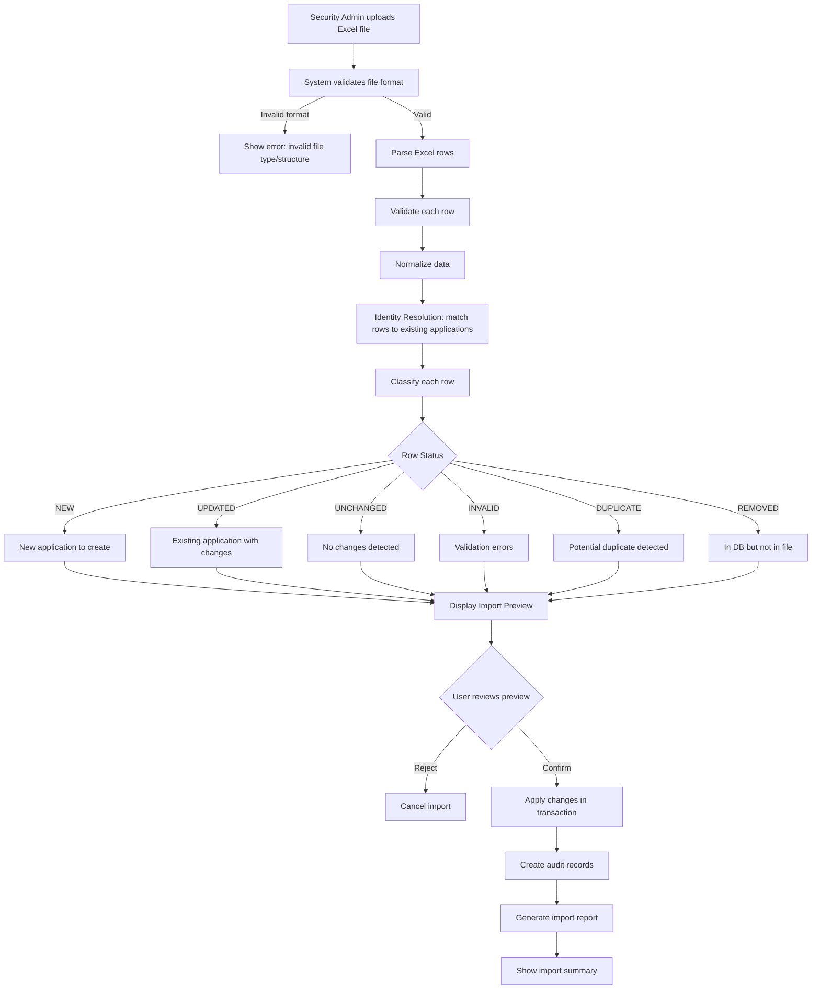

## 2. Jira Assessment Synchronization

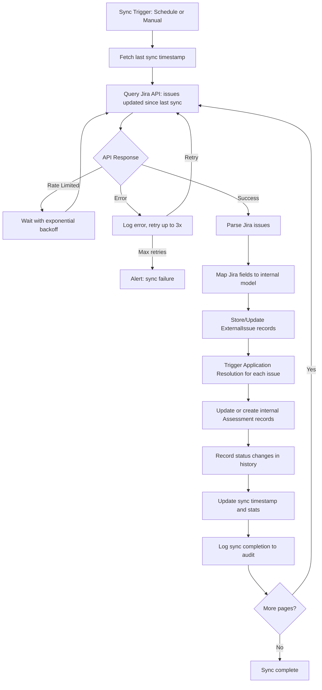

## 3. Jira Vulnerability Synchronization

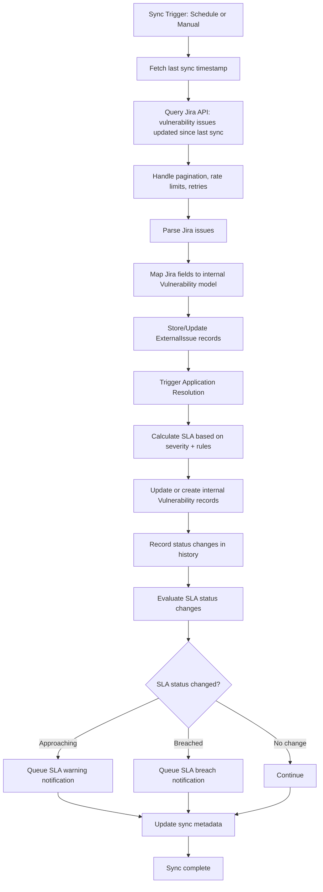

## 4. Application Mapping (AI-Assisted Resolution)

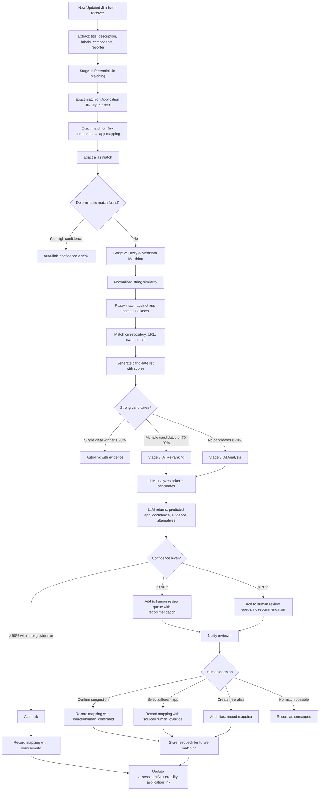

## 5. Assessment Lifecycle

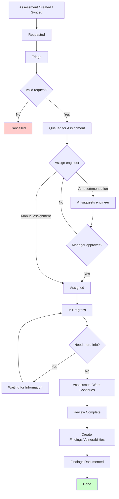

## 6. Vulnerability Lifecycle

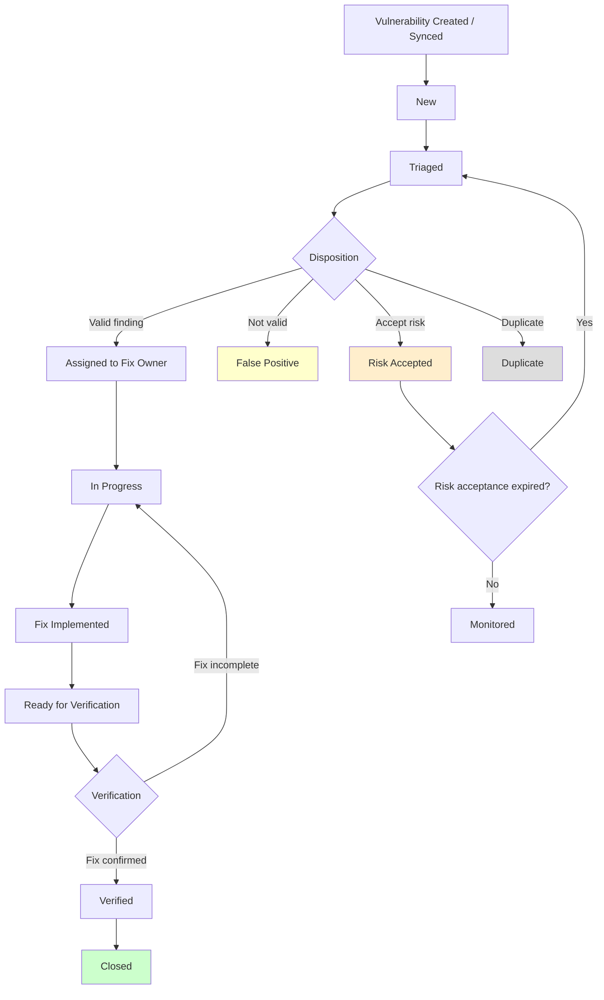

## 7. Security Engineer Assignment (AI-Assisted)

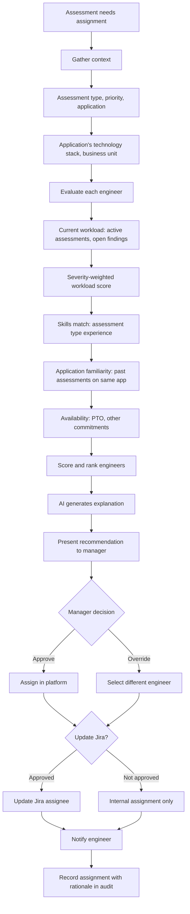

## 8. AI-Assisted Application Resolution (Detail)

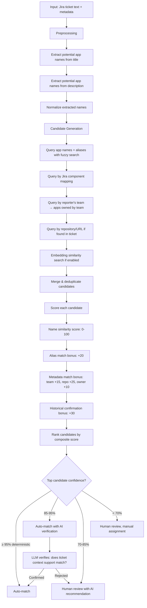

## 9. Natural Language Question Answering

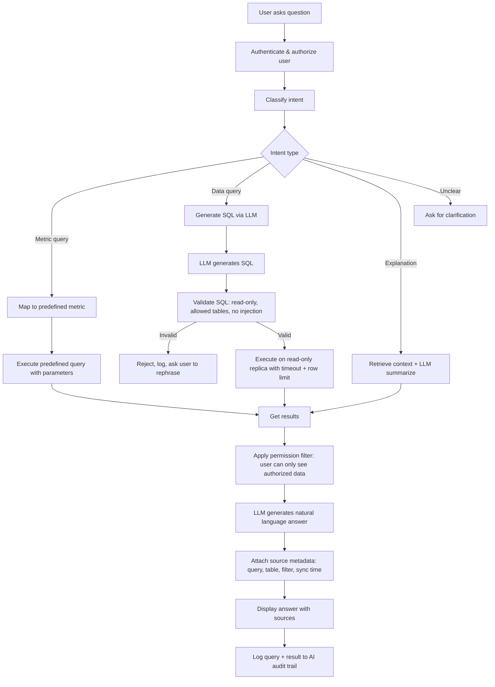

## 10. SLA Alerting

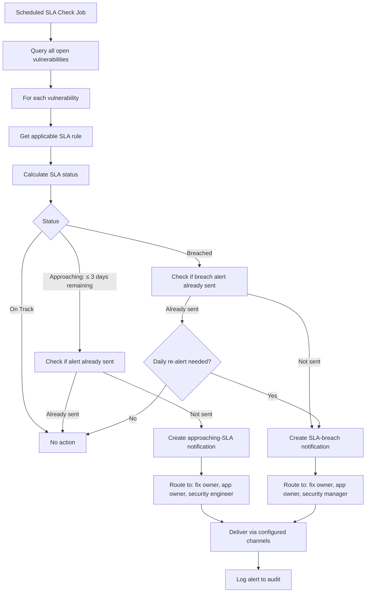

---

# PART H – Information Architecture

## Main Navigation

```
SecPlatform
├── Dashboard
│   ├── Executive Overview (default landing for managers/execs)
│   └── Operations Overview (default landing for engineers)
│
├── Applications
│   ├── All Applications (list, search, filter)
│   ├── Application Detail → 360° Security View
│   ├── By Business Unit
│   ├── By Criticality
│   ├── Never Assessed
│   └── Assessment Overdue
│
├── Assessments
│   ├── All Assessments
│   ├── Waiting Assignment
│   ├── In Progress
│   ├── Overdue
│   ├── Completed
│   └── Assessment Detail
│
├── Vulnerabilities
│   ├── All Vulnerabilities
│   ├── Critical Open
│   ├── SLA Breached
│   ├── Approaching SLA
│   ├── Waiting Verification
│   ├── Risk Accepted
│   └── Vulnerability Detail
│
├── My Work (Security Engineer view)
│   ├── My Assessments
│   ├── My Vulnerabilities
│   ├── Due Soon
│   └── Overdue
│
├── AI Assistant
│   ├── Ask a Question (NLQ)
│   ├── Daily Brief
│   └── Recommendations
│
├── Analytics
│   ├── Vulnerability Trends
│   ├── Assessment Metrics
│   ├── SLA Compliance
│   ├── Team Performance
│   └── Application Coverage
│
├── Mapping Review
│   ├── Pending Review
│   ├── Recently Confirmed
│   └── Unresolved
│
├── 🔔 Notifications (bell icon)
│
├── ⚙️ Administration
│   ├── Users & Roles
│   ├── SLA Rules
│   ├── Assessment Types
│   ├── Workflow Configuration
│   ├── Field Mappings
│   ├── Integrations
│   │   ├── Jira Configuration
│   │   ├── Sync Status
│   │   └── Sync History
│   ├── Import
│   │   ├── Upload Excel
│   │   ├── Import History
│   │   └── Column Mapping
│   ├── Audit Log
│   └── System Settings
```

## URL Structure

```
/                           → Dashboard (role-based default)
/dashboard/executive        → Executive Dashboard
/dashboard/operations       → Operations Dashboard

/applications               → Application List
/applications/:id           → Application 360° View
/applications/:id/assessments
/applications/:id/vulnerabilities
/applications/:id/timeline

/assessments                → Assessment List
/assessments/:id            → Assessment Detail

/vulnerabilities            → Vulnerability List
/vulnerabilities/:id        → Vulnerability Detail

/workspace                  → My Work (Engineer)

/ai                         → AI Assistant
/ai/brief                   → Daily Brief

/analytics                  → Analytics Hub
/analytics/vulnerabilities  → Vulnerability Analytics
/analytics/assessments      → Assessment Analytics
/analytics/sla              → SLA Analytics

/mappings                   → Mapping Review Queue

/admin                      → Administration
/admin/users                → User Management
/admin/sla                  → SLA Rules
/admin/workflows            → Workflow Config
/admin/integrations         → Integrations
/admin/integrations/jira    → Jira Config
/admin/imports              → Import Management
/admin/audit                → Audit Log
/admin/settings             → System Settings

/notifications              → Notification Center
/search                     → Global Search Results
```

---

# PART I – UX / UI Design

## Core Screen Designs

### 1. Main Dashboard (Executive)

**Purpose:** High-level security posture overview for leadership.  
**Primary Users:** Security Manager, CISO, Executive  

**Layout:**

```
┌─────────────────────────────────────────────────────────────┐
│  SecPlatform          [🔍 Search]    [🔔 3]    [User ▼]    │
├─────────────────────────────────────────────────────────────┤
│  Dashboard > Executive Overview                             │
│  ┌──────────────────────────────────────────────────────┐   │
│  │  Date Range: [Last 30 days ▼]  BU: [All ▼]          │   │
│  └──────────────────────────────────────────────────────┘   │
│                                                             │
│  ┌─────────┐ ┌─────────┐ ┌─────────┐ ┌─────────┐          │
│  │  1,247  │ │   87%   │ │   342   │ │  91.3%  │          │
│  │  Total  │ │ Assess  │ │  Open   │ │  SLA    │          │
│  │  Apps   │ │Coverage │ │  Vulns  │ │Compliant│          │
│  └─────────┘ └─────────┘ └─────────┘ └─────────┘          │
│                                                             │
│  ┌──────────────────────┐  ┌──────────────────────┐        │
│  │ Vulnerability Trend  │  │ Assessment Coverage  │        │
│  │  📈 Line chart       │  │  📊 Stacked bar      │        │
│  │  (12 month by sev)   │  │  (assessed vs not)   │        │
│  └──────────────────────┘  └──────────────────────┘        │
│                                                             │
│  ┌──────────────────────┐  ┌──────────────────────┐        │
│  │ SLA Compliance Trend │  │ Severity Distribution│        │
│  │  📈 Line chart       │  │  🍩 Donut chart      │        │
│  │  (monthly %)         │  │  (C/H/M/L)           │        │
│  └──────────────────────┘  └──────────────────────┘        │
│                                                             │
│  ┌──────────────────────────────────────────────────────┐   │
│  │ AI Daily Brief Summary                    [View Full]│   │
│  │ • 3 Critical vulns approaching SLA breach            │   │
│  │ • Payment Gateway: 2 unresolved Critical findings    │   │
│  │ • 7 assessments waiting for assignment               │   │
│  └──────────────────────────────────────────────────────┘   │
│                                                             │
│  ┌──────────────────────────────────────────────────────┐   │
│  │ Top Risk Applications              [View All]        │   │
│  │ ┌──────────────┬──────┬──────┬──────┬───────────┐    │   │
│  │ │ Application  │ Crit │ High │ Open │ SLA Status│    │   │
│  │ ├──────────────┼──────┼──────┼──────┼───────────┤    │   │
│  │ │ Payment GW   │  2   │  4   │  8   │ ⚠ At Risk │    │   │
│  │ │ Auth Service │  1   │  3   │  6   │ 🔴 Breach │    │   │
│  │ │ Mobile API   │  0   │  5   │  5   │ ✅ On Track│    │   │
│  │ └──────────────┴──────┴──────┴──────┴───────────┘    │   │
│  └──────────────────────────────────────────────────────┘   │
└─────────────────────────────────────────────────────────────┘
```

**Filters:** Date range, Business Unit, Criticality  
**Drill-downs:** Click any metric to see underlying data  
**AI:** Daily brief summary with link to full brief  

### 2. Application List

**Purpose:** Browse, search, and filter the application inventory.  
**Primary Users:** Security Manager, Security Engineer, App Owner  

```
┌─────────────────────────────────────────────────────────────┐
│  Applications                    [+ Add Application] [Import]│
│                                                              │
│  [🔍 Search applications...]                                │
│                                                              │
│  Filters: [Status ▼] [Criticality ▼] [BU ▼] [Internet ▼]  │
│           [Assessment Status ▼] [Has Open Vulns ▼]          │
│                                                              │
│  Quick views: [All] [Never Assessed] [Assessment Overdue]   │
│               [Has Critical Vulns] [Internet Facing]        │
│                                                              │
│  Showing 1,247 applications                [Export CSV]      │
│  ┌───┬──────────────┬──────┬─────────┬──────┬──────┬──────┐ │
│  │   │ Name         │Crit. │ BU      │Vulns │Assess│ SLA  │ │
│  ├───┼──────────────┼──────┼─────────┼──────┼──────┼──────┤ │
│  │ ☐ │ Payment GW   │ High │ Finance │ C:2  │ Due  │ ⚠    │ │
│  │   │              │      │         │ H:4  │ 30d  │      │ │
│  ├───┼──────────────┼──────┼─────────┼──────┼──────┼──────┤ │
│  │ ☐ │ Auth Service │ Crit │ Platform│ C:1  │ OK   │ 🔴   │ │
│  │   │              │      │         │ H:3  │      │      │ │
│  └───┴──────────────┴──────┴─────────┴──────┴──────┴──────┘ │
│                                                              │
│  [◀ 1 2 3 ... 42 ▶]     25 per page ▼                      │
└─────────────────────────────────────────────────────────────┘
```

**Actions:** Click row → Application Detail; Bulk select → Bulk update; Export

### 3. Application Detail (360° Security View)

**Purpose:** Complete security posture for a single application.  
**Primary Users:** All personas  

```
┌─────────────────────────────────────────────────────────────┐
│  ◀ Applications / Payment Gateway                           │
│                                                              │
│  ┌────────────────────────────────────────────────────────┐  │
│  │ 🤖 AI Security Summary                                │  │
│  │ "Payment Gateway has 2 Critical and 4 High open       │  │
│  │  vulnerabilities. Periodic assessment is overdue by   │  │
│  │  45 days. Last assessed: 2026-03-15."                 │  │
│  └────────────────────────────────────────────────────────┘  │
│                                                              │
│  [Overview] [Assessments] [Vulnerabilities] [Timeline] [Jira]│
│                                                              │
│  ── Overview Tab ──────────────────────────────────────────  │
│  ┌─────────────────────┐  ┌──────────────────────────────┐  │
│  │ Application Info    │  │ Vulnerability Summary        │  │
│  │ ID: APP-0142        │  │ ┌───────────┬───────┬──────┐ │  │
│  │ Name: Payment GW    │  │ │ Severity  │ Open  │Total │ │  │
│  │ Criticality: High   │  │ ├───────────┼───────┼──────┤ │  │
│  │ BU: Finance         │  │ │ Critical  │  2    │  5   │ │  │
│  │ Internet: Yes       │  │ │ High      │  4    │  12  │ │  │
│  │ Status: Active      │  │ │ Medium    │  3    │  18  │ │  │
│  │ Data Class: Conf.   │  │ │ Low       │  1    │  8   │ │  │
│  │ Compliance: PCI     │  │ └───────────┴───────┴──────┘ │  │
│  │                     │  │ SLA Breached: 3              │  │
│  │ App Owner: J. Smith │  │ Approaching SLA: 2           │  │
│  │ Tech Owner: K. Lee  │  └──────────────────────────────┘  │
│  │ Sec Owner: M. Chen  │                                    │
│  └─────────────────────┘                                    │
│                                                              │
│  ┌─────────────────────────┐ ┌───────────────────────────┐  │
│  │ Assessment Status       │ │ SLA Compliance            │  │
│  │ Last Assessment:        │ │ ████████░░ 78%            │  │
│  │   2026-03-15 (Periodic) │ │                           │  │
│  │ Next Due: 2026-03-15    │ │ On Track: 7               │  │
│  │   ⚠ OVERDUE 45 days    │ │ At Risk: 2                │  │
│  │ Go-Live Assessment: ✅  │ │ Breached: 3               │  │
│  │ Total Assessments: 8    │ │                           │  │
│  └─────────────────────────┘ └───────────────────────────┘  │
│                                                              │
│  ── Assessments Tab (linked assessments list) ──             │
│  ── Vulnerabilities Tab (linked vulnerabilities list) ──     │
│  ── Timeline Tab (chronological events) ──                   │
│  ── Jira Tab (related Jira tickets) ──                       │
└─────────────────────────────────────────────────────────────┘
```

### 4. Assessment List

**Purpose:** Browse and manage security assessments.  
**Primary Users:** Security Manager, Security Engineer  

**Filters:** Status, Type, Assignee, Application, Priority, Date range, SLA status  
**Quick views:** Waiting Assignment, In Progress, Overdue, Completed This Week  
**Actions:** Assign, Change status, Bulk operations  
**Columns:** Jira Key, Title, Type, Application, Assignee, Status, Priority, Due Date, SLA Status

### 5. Assessment Detail

**Purpose:** Full view of a single assessment.  
**Primary Users:** Security Engineer, Security Manager  

**Sections:**
- Header: Jira key, title, status badge, priority, assignment
- Sidebar: Metadata (type, dates, SLA, assignee)
- Linked Application(s) with quick security context
- Findings/Vulnerabilities discovered in this assessment
- Jira ticket content (description, comments — rendered safely)
- Status history timeline
- Actions: Change status, Create finding, Reassign, Sync with Jira

### 6. Vulnerability List

**Purpose:** Browse and manage vulnerability findings.  
**Primary Users:** Security Engineer, Security Manager, Developer  

**Filters:** Severity, Status, Application, SLA Status, Assignee, Type, Date range  
**Quick views:** Critical Open, SLA Breached, Approaching SLA, Waiting Verification  
**Columns:** ID, Jira Key, Title, Severity, Application, Status, Fix Owner, Due Date, SLA Status, Age

### 7. Vulnerability Detail

**Purpose:** Full view of a single vulnerability.  
**Primary Users:** Security Engineer, Developer  

**Sections:**
- Header: ID, title, severity badge, status
- Sidebar: Metadata (CWE, CVE, CVSS, dates, SLA, assignee)
- Linked Application(s)
- Source Assessment
- Description and Recommendation
- Evidence
- Risk Acceptance history (if any)
- Status history timeline
- Comments
- Actions: Update status, Assign, Accept Risk, Verify, Link to assessment

### 8. Excel Import Wizard

**Purpose:** Step-by-step guided import of application inventory.  
**Primary Users:** Security Administrator  

```
Step 1: Upload          Step 2: Map Columns    Step 3: Preview
━━━━━━━━━━━━━━━━━━     ━━━━━━━━━━━━━━━━━     ━━━━━━━━━━━━━━

┌──────────────────┐   ┌──────────────────┐   ┌──────────────────┐
│                  │   │ Excel Column     │   │ Summary:         │
│  Drag & Drop     │   │ → System Field   │   │  New: 23         │
│  .xlsx file      │   │                  │   │  Updated: 145    │
│                  │   │ "App Name"       │   │  Unchanged: 876  │
│  or [Browse]     │   │  → app_name  ▼   │   │  Invalid: 5      │
│                  │   │ "BU"             │   │  Removed: 12     │
│  Max 50MB        │   │  → business_unit▼│   │  Duplicate: 3    │
│  .xlsx only      │   │ "Owner"          │   │                  │
│                  │   │  → app_owner   ▼ │   │ [View Details]   │
└──────────────────┘   │ "Crit"           │   │ [View Errors]    │
                       │  → criticality ▼ │   │                  │
                       │                  │   │ [Cancel] [Import]│
                       │ [Save Mapping]   │   │                  │
                       └──────────────────┘   └──────────────────┘

Step 4: Results
━━━━━━━━━━━━━━━━
┌──────────────────┐
│ Import Complete  │
│                  │
│ ✅ Created: 23   │
│ ✏️ Updated: 145  │
│ ⚠️ Skipped: 5    │
│ 🗑️ Flagged: 12   │
│                  │
│ [Download Report]│
│ [View Changes]   │
└──────────────────┘
```

### 9. Application Mapping Review

**Purpose:** Review and confirm AI-suggested application-to-ticket mappings.  
**Primary Users:** Security Engineer, Security Administrator  

```
┌─────────────────────────────────────────────────────────────┐
│  Mapping Review Queue                          [14 pending] │
│                                                              │
│  ┌──────────────────────────────────────────────────────┐   │
│  │ SEC-1234: "Security Review - Payment API v2"        │   │
│  │                                                      │   │
│  │ 🤖 AI Suggestion: Payment Gateway (87% confidence)  │   │
│  │                                                      │   │
│  │ Evidence:                                            │   │
│  │ • Title contains "Payment API" → alias of Payment GW│   │
│  │ • Reporter is in Finance team → matches BU          │   │
│  │ • 3 previous tickets from same reporter mapped to GW│   │
│  │                                                      │   │
│  │ Alternatives:                                        │   │
│  │ • Payment Processing Service (42%)                   │   │
│  │ • Payment Reconciliation (28%)                       │   │
│  │                                                      │   │
│  │ [✅ Confirm: Payment Gateway]  [🔄 Select Other]    │   │
│  │ [❌ No Match]  [➕ Create Alias "Payment API v2"]   │   │
│  └──────────────────────────────────────────────────────┘   │
│                                                              │
│  ┌──────────────────────────────────────────────────────┐   │
│  │ SEC-1235: "Pentest for customer-auth"               │   │
│  │ ...                                                  │   │
│  └──────────────────────────────────────────────────────┘   │
└─────────────────────────────────────────────────────────────┘
```

### 10. Security Engineer Workspace

**Purpose:** Personal work management view for security engineers.  
**Primary Users:** Security Engineer  

```
┌─────────────────────────────────────────────────────────────┐
│  My Work                           Welcome, Maria Chen      │
│                                                              │
│  ┌──────┐ ┌──────┐ ┌──────┐ ┌──────┐                       │
│  │  3   │ │  12  │ │  2   │ │  5   │                       │
│  │Active│ │Open  │ │Over- │ │Due   │                       │
│  │Assess│ │Vulns │ │due   │ │Soon  │                       │
│  └──────┘ └──────┘ └──────┘ └──────┘                       │
│                                                              │
│  🤖 AI Priority Recommendation:                             │
│  "SEC-1240 should be prioritized — Critical vuln with 2     │
│   days until SLA breach on internet-facing Payment GW."     │
│                                                              │
│  ── My Assessments ──────────────────────────────────────   │
│  │ SEC-1240 │ Periodic - Payment GW │ In Progress │ ⚠ 2d  │ │
│  │ SEC-1238 │ Go-Live - Mobile App  │ Assigned    │ 14d   │ │
│  │ SEC-1235 │ Pentest - Auth Svc    │ In Progress │ 7d    │ │
│                                                              │
│  ── My Open Vulnerabilities ────────────────────────────    │
│  │ VUL-890 │ SQL Injection │ Crit │ Payment GW │ 🔴 SLA  │ │
│  │ VUL-887 │ XSS Stored    │ High │ Portal     │ ⚠ 3d   │ │
│  │ ...                                                      │
│                                                              │
│  ── Waiting Verification ────────────────────────────────   │
│  │ VUL-845 │ IDOR          │ High │ Mobile API │ Verify  │ │
│  │ VUL-832 │ CSRF          │ Med  │ Admin UI   │ Verify  │ │
│                                                              │
│  ── Recent Activity ─────────────────────────────────────   │
│  │ 10:30 │ VUL-890 status → In Progress                    │
│  │ 09:15 │ SEC-1238 assigned to you                        │
│  │ Yesterday │ SEC-1240 findings created (3 vulns)          │
└─────────────────────────────────────────────────────────────┘
```

### 11. AI Assistant

**Purpose:** Natural language interface for security data queries.  
**Primary Users:** All  

```
┌─────────────────────────────────────────────────────────────┐
│  AI Security Assistant                                       │
│                                                              │
│  ┌──────────────────────────────────────────────────────┐   │
│  │ Suggested questions:                                 │   │
│  │ • How many Critical vulnerabilities are open?        │   │
│  │ • Which applications are overdue for assessment?     │   │
│  │ • Show team workload distribution                    │   │
│  │ • What's the SLA compliance trend this quarter?      │   │
│  └──────────────────────────────────────────────────────┘   │
│                                                              │
│  ┌ You ─────────────────────────────────────────────────┐   │
│  │ How many vulnerabilities were created in August?     │   │
│  └──────────────────────────────────────────────────────┘   │
│                                                              │
│  ┌ AI ──────────────────────────────────────────────────┐   │
│  │ **127 vulnerabilities** were created in August 2026. │   │
│  │                                                      │   │
│  │ Breakdown by severity:                               │   │
│  │ • Critical: 8                                        │   │
│  │ • High: 34                                           │   │
│  │ • Medium: 52                                         │   │
│  │ • Low: 33                                            │   │
│  │                                                      │   │
│  │ This is a 15% increase from July (110 vulns).        │   │
│  │                                                      │   │
│  │ 📊 Source: Vulnerability table                       │   │
│  │ 📅 Period: Aug 1-25, 2026                            │   │
│  │ 🔄 Last synced: Aug 25, 10:30 AM                    │   │
│  │                                                      │   │
│  │ [View Query] [View Data] [Export]                    │   │
│  └──────────────────────────────────────────────────────┘   │
│                                                              │
│  ┌──────────────────────────────────────────────────────┐   │
│  │ [Ask a question about your security data...]  [Send] │   │
│  └──────────────────────────────────────────────────────┘   │
└─────────────────────────────────────────────────────────────┘
```

### 12. Integration Status

**Purpose:** Monitor health of external integrations.  
**Primary Users:** Security Administrator  

**Sections:**
- Integration cards: Jira (active), future integrations (planned)
- Per integration: Last sync time, sync status, records synced, errors, next scheduled sync
- Sync history table with status, duration, records processed, errors
- Manual sync trigger button
- Configuration link

### 13. Notification Center

**Purpose:** View and manage all notifications.  
**Primary Users:** All  

**Sections:**
- Unread/All toggle
- Filter by type (SLA, mapping, sync, assessment)
- Notification list with timestamp, type icon, message, link to related entity
- Mark as read, dismiss, notification preferences link

### 14. Admin Settings

**Purpose:** Platform configuration.  
**Primary Users:** System Administrator, Security Administrator  

**Sub-pages:**
- **Users & Roles:** User list, role assignment, invite user
- **SLA Rules:** Rule editor with severity × criticality matrix
- **Assessment Types:** Manage assessment type catalog
- **Workflows:** Status workflow configuration (visual editor, Phase 2)
- **Field Mappings:** Jira-to-internal field mapping configuration
- **Integrations:** Jira connection settings, credentials, project selection
- **Import Settings:** Default column mappings, validation rules
- **System:** Audit retention, notification defaults, feature flags

---

# PART J – Dashboard Design

## 1. Executive Security Dashboard

**Audience:** CISO, VP Security, Security Manager, Executive  
**Purpose:** Communicate organizational security risk posture at a glance  
**Refresh:** Real-time with configurable date range  

**KPIs (top cards):**

| KPI | Calculation | Target |
|-----|------------|--------|
| Total Applications | Count of active applications | Informational |
| Assessment Coverage | % of apps with assessment within policy period | > 90% |
| Open Vulnerabilities | Count of vulns not in terminal state | Trending down |
| Critical Open | Count of Critical severity open vulns | 0 |
| SLA Compliance | % of vulns resolved within SLA | > 90% |
| Overdue Assessments | Count of apps past next-assessment-due | 0 |

**Charts:**

| Chart | Type | Data | Drill-down |
|-------|------|------|-----------|
| Vulnerability Trend | Line, 12-month | Open vulns by severity per month | Click month → vuln list |
| Assessment Pipeline | Stacked bar | Assessments by status per month | Click → assessment list |
| SLA Compliance Trend | Line | Monthly SLA compliance % | Click → SLA detail |
| Severity Distribution | Donut | Open vulns by severity | Click segment → filtered list |
| Top Risk Applications | Table (top 10) | Apps ranked by open Critical+High | Click row → app detail |
| Business Unit Comparison | Horizontal bar | Open vulns by BU | Click bar → BU filtered view |

**Filters:** Date range, Business Unit, Criticality, Internet-facing  
**AI:** Daily brief summary widget with link to full brief  

## 2. Security Operations Dashboard

**Audience:** Security Manager, Security Engineer  
**Purpose:** Day-to-day operational visibility for the security team  

**KPIs:**

| KPI | Calculation |
|-----|------------|
| Assessment Backlog | Count of assessments not yet completed |
| Waiting Assignment | Assessments in Queued/Unassigned status |
| In Progress | Active assessments |
| New Vulns (This Week) | Vulns created in last 7 days |
| SLA Breaches (Active) | Open vulns past due date |
| Approaching SLA | Vulns due within 7 days |
| Verification Backlog | Vulns in Ready for Verification |
| Avg Completion Time | Mean days from assessment start to done (rolling 90d) |

**Charts:**

| Chart | Type | Data |
|-------|------|------|
| Assessment by Status | Horizontal bar | Count per status |
| Assessment by Type | Pie/donut | Count per assessment type |
| Workload by Engineer | Stacked bar | Active items per engineer by severity |
| Vulnerability Aging | Histogram | Open vulns grouped by age bucket |
| New vs Closed Vulns | Dual line | Weekly new vs closed |
| SLA Breach Trend | Line | Weekly count of active SLA breaches |

**Tables:**
- Overdue assessments (sortable by overdue days)
- Recent SLA breaches
- Unassigned assessments

**Actions:** Assign assessment, navigate to engineer workspace, trigger Jira sync

## 3. Application Security Dashboard (per-app)

**Audience:** Application Owner, Security Engineer, Security Manager  
**Purpose:** Complete security view for one application (part of 360° view)  

*Described in detail in the Application Detail screen above (Part I, Screen 3).*

**Additional charts on the Application Detail page:**

| Chart | Type | Data |
|-------|------|------|
| Vulnerability History | Stacked area | Open vulns over time by severity |
| Assessment Timeline | Gantt-like | Assessment periods on timeline |
| Time to Remediate | Box plot or bar | MTTR by severity |

## 4. Team Workload Dashboard

**Audience:** Security Manager  
**Purpose:** Balance workload across the security team  

**Metrics per engineer:**
- Active assessments (count, severity-weighted)
- Open vulnerabilities assigned
- Items due this week
- Items overdue
- Assessments completed (rolling 30d)

**Charts:**
- Workload heatmap: Engineers × severity
- Comparison bar chart: Engineer workload scores
- Trend: Per-engineer throughput over time

**AI:** "Engineer A's workload is 2.3× the team average. Consider redistributing SEC-1240."

## 5. Analytics Dashboard (Additional)

**Audience:** Security Manager, Executive  
**Purpose:** Historical trends and program effectiveness  

**Views:**
- **Vulnerability Trends:** Monthly created, closed, net change; by severity, by BU
- **Assessment Metrics:** Throughput, completion time distribution, backlog aging
- **SLA Performance:** Compliance by severity, by BU, by quarter; MTTR trends
- **Coverage Analysis:** Assessment coverage by BU, by criticality tier, by internet-facing status
- **Program Maturity:** Year-over-year comparison of key metrics

---

# PART K – Data Model

## Entity Descriptions

### Application

**Purpose:** Core asset record representing a company application or technology asset.

| Field | Type | Constraints | Description |
|-------|------|------------|-------------|
| id | UUID | PK | Internal unique identifier |
| application_id | VARCHAR(50) | UNIQUE, NOT NULL | Official application identifier (e.g., APP-0142) |
| name | VARCHAR(255) | NOT NULL | Official application name |
| normalized_name | VARCHAR(255) | INDEXED | Lowercase, trimmed, normalized for matching |
| description | TEXT | | Application description |
| business_unit_id | UUID | FK → BusinessUnit | Owning business unit |
| department | VARCHAR(100) | | Department within BU |
| criticality | ENUM | NOT NULL | Critical, High, Medium, Low |
| internet_facing | BOOLEAN | DEFAULT false | Whether internet-accessible |
| data_classification | VARCHAR(50) | | Public, Internal, Confidential, Restricted |
| compliance_scope | VARCHAR(255)[] | | Applicable compliance frameworks |
| technology_stack | VARCHAR(255)[] | | Technologies used |
| repository_url | VARCHAR(500) | | Source code repository |
| service_url | VARCHAR(500) | | Service endpoint |
| production_url | VARCHAR(500) | | Production URL |
| status | ENUM | NOT NULL, DEFAULT 'Active' | Active, Decommissioned, Planning, Archived |
| go_live_date | DATE | | When the application went live |
| created_at | TIMESTAMPTZ | NOT NULL | Record creation time |
| updated_at | TIMESTAMPTZ | NOT NULL | Last modification time |
| created_by | UUID | FK → User | Who created the record |
| updated_by | UUID | FK → User | Who last modified |
| last_import_id | UUID | FK → AssetImport | Last import that touched this record |

**Additional recommended fields:**
- `risk_rating` (calculated or assigned overall risk)
- `last_assessment_date` (denormalized for query performance)
- `next_assessment_due` (denormalized, updated by assessment module)
- `open_vulnerability_count` (denormalized counter, updated by triggers/jobs)
- `open_critical_count` (denormalized)

**Indexes:** `normalized_name`, `business_unit_id`, `criticality`, `status`, `application_id`

### ApplicationAlias

**Purpose:** Known alternative names for an application, used in entity resolution.

| Field | Type | Constraints | Description |
|-------|------|------------|-------------|
| id | UUID | PK | |
| application_id | UUID | FK → Application, NOT NULL | Parent application |
| alias | VARCHAR(255) | NOT NULL | Alternative name |
| normalized_alias | VARCHAR(255) | INDEXED | Normalized for matching |
| source | ENUM | NOT NULL | manual, import, ai_learned, jira_component |
| created_at | TIMESTAMPTZ | NOT NULL | |
| created_by | UUID | FK → User | |

**Unique constraint:** (application_id, normalized_alias)

### ApplicationOwner

**Purpose:** Track multiple ownership types for each application.

| Field | Type | Constraints | Description |
|-------|------|------------|-------------|
| id | UUID | PK | |
| application_id | UUID | FK → Application, NOT NULL | |
| user_id | UUID | FK → User | |
| owner_name | VARCHAR(255) | | If user not in system |
| owner_email | VARCHAR(255) | | |
| owner_type | ENUM | NOT NULL | application_owner, technical_owner, security_owner |
| is_primary | BOOLEAN | DEFAULT false | Primary owner of this type |
| created_at | TIMESTAMPTZ | | |

### BusinessUnit

**Purpose:** Organizational unit hierarchy.

| Field | Type | Constraints | Description |
|-------|------|------------|-------------|
| id | UUID | PK | |
| name | VARCHAR(100) | UNIQUE, NOT NULL | |
| parent_id | UUID | FK → BusinessUnit | Parent unit for hierarchy |
| head_user_id | UUID | FK → User | BU leader |

### Assessment

**Purpose:** Internal representation of a security assessment activity.

| Field | Type | Constraints | Description |
|-------|------|------------|-------------|
| id | UUID | PK | |
| internal_key | VARCHAR(20) | UNIQUE | Internal reference (auto-generated) |
| title | VARCHAR(500) | NOT NULL | Assessment title |
| description | TEXT | | Assessment description |
| assessment_type_id | UUID | FK → AssessmentType, NOT NULL | Type of assessment |
| status | VARCHAR(50) | NOT NULL | Current internal status |
| priority | ENUM | | Critical, High, Medium, Low |
| requester_id | UUID | FK → User | Who requested |
| assignee_id | UUID | FK → User | Assigned security engineer |
| created_date | TIMESTAMPTZ | NOT NULL | |
| due_date | DATE | | Assessment due date |
| started_date | TIMESTAMPTZ | | When work began |
| completed_date | TIMESTAMPTZ | | When assessment finished |
| finding_count | INTEGER | DEFAULT 0 | Number of findings created |
| external_issue_id | UUID | FK → ExternalIssue | Linked external issue |
| last_synced_at | TIMESTAMPTZ | | Last sync from external source |
| created_at | TIMESTAMPTZ | NOT NULL | |
| updated_at | TIMESTAMPTZ | NOT NULL | |

**Indexes:** `status`, `assignee_id`, `assessment_type_id`, `due_date`, `external_issue_id`

**Additional recommended fields:**
- `sla_status` (calculated: on_track, at_risk, breached)
- `complexity` (estimated assessment complexity)
- `security_skills_required` (VARCHAR[])

### AssessmentType

**Purpose:** Catalog of assessment types.

| Field | Type | Constraints | Description |
|-------|------|------------|-------------|
| id | UUID | PK | |
| name | VARCHAR(100) | UNIQUE, NOT NULL | e.g., "Go-Live Security Assessment" |
| code | VARCHAR(50) | UNIQUE | Short code: GOLIVE, PERIODIC, PENTEST |
| description | TEXT | | |
| default_sla_days | INTEGER | | Default days to complete |
| is_active | BOOLEAN | DEFAULT true | |
| requires_periodic | BOOLEAN | DEFAULT false | Whether apps need this periodically |
| period_months | INTEGER | | If periodic, how often (months) |

### AssessmentApplication (Junction)

**Purpose:** M:N link between assessments and applications.

| Field | Type | Constraints | Description |
|-------|------|------------|-------------|
| assessment_id | UUID | FK → Assessment, PK | |
| application_id | UUID | FK → Application, PK | |
| is_primary | BOOLEAN | DEFAULT true | Primary application for this assessment |
| mapped_by | ENUM | | auto, manual, ai_confirmed |
| mapping_confidence | DECIMAL(5,2) | | Confidence of mapping |
| created_at | TIMESTAMPTZ | | |

### Vulnerability

**Purpose:** Internal representation of a security finding.

| Field | Type | Constraints | Description |
|-------|------|------------|-------------|
| id | UUID | PK | |
| internal_key | VARCHAR(20) | UNIQUE | Internal reference |
| title | VARCHAR(500) | NOT NULL | |
| description | TEXT | | |
| vulnerability_type | VARCHAR(100) | | e.g., "SQL Injection", "XSS" |
| cwe_id | VARCHAR(20) | | CWE identifier |
| cve_id | VARCHAR(20) | | CVE identifier |
| cvss_score | DECIMAL(3,1) | | CVSS score |
| cvss_vector | VARCHAR(100) | | CVSS vector string |
| severity | ENUM | NOT NULL | Critical, High, Medium, Low, Informational |
| status | VARCHAR(50) | NOT NULL | Current internal status |
| source_assessment_id | UUID | FK → Assessment | Assessment that discovered this |
| assignee_id | UUID | FK → User | Security engineer |
| fix_owner_id | UUID | FK → User | Developer responsible for fix |
| created_date | TIMESTAMPTZ | NOT NULL | |
| due_date | DATE | | SLA due date |
| fixed_date | TIMESTAMPTZ | | When fix was applied |
| verified_date | TIMESTAMPTZ | | When fix was verified |
| closed_date | TIMESTAMPTZ | | When vuln was closed |
| sla_status | ENUM | | on_track, at_risk, breached, paused, exempt |
| overdue_days | INTEGER | | Calculated overdue days |
| recommendation | TEXT | | Remediation recommendation |
| evidence | TEXT | | Evidence/proof of vulnerability |
| root_cause | TEXT | | Root cause analysis |
| environment | VARCHAR(50) | | Environment where found |
| external_issue_id | UUID | FK → ExternalIssue | Linked external issue |
| last_synced_at | TIMESTAMPTZ | | |
| created_at | TIMESTAMPTZ | NOT NULL | |
| updated_at | TIMESTAMPTZ | NOT NULL | |

**Indexes:** `severity`, `status`, `sla_status`, `due_date`, `assignee_id`, `fix_owner_id`, `external_issue_id`

**Additional recommended fields:**
- `source` (assessment, scan, pentest, bug_bounty, manual)
- `affected_component` (specific component/module affected)
- `remediation_effort` (estimated effort: low, medium, high)
- `is_false_positive` (boolean, for analytics)

### VulnerabilityApplication (Junction)

**Purpose:** M:N link between vulnerabilities and applications.

| Field | Type | Constraints | Description |
|-------|------|------------|-------------|
| vulnerability_id | UUID | FK → Vulnerability, PK | |
| application_id | UUID | FK → Application, PK | |
| is_primary | BOOLEAN | DEFAULT true | |
| created_at | TIMESTAMPTZ | | |

### StatusHistory (shared pattern for Assessment and Vulnerability)

**Purpose:** Track every status change for audit and analytics.

| Field | Type | Constraints | Description |
|-------|------|------------|-------------|
| id | UUID | PK | |
| entity_type | ENUM | NOT NULL | assessment, vulnerability |
| entity_id | UUID | NOT NULL | FK to assessment or vulnerability |
| from_status | VARCHAR(50) | | Previous status (null for initial) |
| to_status | VARCHAR(50) | NOT NULL | New status |
| changed_by | UUID | FK → User | |
| changed_at | TIMESTAMPTZ | NOT NULL | |
| reason | TEXT | | Reason for change |
| source | ENUM | | manual, jira_sync, system |

**Indexes:** (entity_type, entity_id, changed_at)

### RiskAcceptance

**Purpose:** Formal risk acceptance for a vulnerability.

| Field | Type | Constraints | Description |
|-------|------|------------|-------------|
| id | UUID | PK | |
| vulnerability_id | UUID | FK → Vulnerability, NOT NULL | |
| accepted_by | UUID | FK → User, NOT NULL | |
| approved_by | UUID | FK → User | Manager who approved |
| justification | TEXT | NOT NULL | |
| accepted_date | TIMESTAMPTZ | NOT NULL | |
| expiration_date | DATE | | When acceptance expires |
| status | ENUM | NOT NULL | active, expired, revoked |
| conditions | TEXT | | Conditions of acceptance |
| created_at | TIMESTAMPTZ | | |

### ExternalIssue

**Purpose:** Raw data from external systems (Jira, future sources), decoupled from internal entities.

| Field | Type | Constraints | Description |
|-------|------|------------|-------------|
| id | UUID | PK | |
| source | ENUM | NOT NULL | jira, servicenow, github, etc. |
| source_id | VARCHAR(100) | NOT NULL | External ID (e.g., Jira issue key) |
| source_project | VARCHAR(100) | | External project |
| issue_type | VARCHAR(50) | | Jira issue type |
| title | VARCHAR(500) | | |
| description | TEXT | | Raw description |
| status | VARCHAR(100) | | External status |
| priority | VARCHAR(50) | | External priority |
| assignee_email | VARCHAR(255) | | |
| reporter_email | VARCHAR(255) | | |
| labels | VARCHAR(100)[] | | |
| components | VARCHAR(100)[] | | |
| custom_fields | JSONB | | Extensible custom field storage |
| created_date | TIMESTAMPTZ | | External created date |
| updated_date | TIMESTAMPTZ | | External updated date |
| resolved_date | TIMESTAMPTZ | | |
| raw_data | JSONB | | Full external record for reference |
| last_synced_at | TIMESTAMPTZ | NOT NULL | |
| sync_status | ENUM | | synced, error, deleted |
| created_at | TIMESTAMPTZ | NOT NULL | |
| updated_at | TIMESTAMPTZ | NOT NULL | |

**Unique constraint:** (source, source_id)  
**Indexes:** `source_id`, `source`, `status`, `last_synced_at`

### ApplicationMapping

**Purpose:** Record of a resolved mapping between an external reference and an internal application.

| Field | Type | Constraints | Description |
|-------|------|------------|-------------|
| id | UUID | PK | |
| external_issue_id | UUID | FK → ExternalIssue, NOT NULL | |
| application_id | UUID | FK → Application | Resolved application (null if unresolved) |
| status | ENUM | NOT NULL | auto_matched, human_confirmed, human_overridden, unresolved, rejected |
| confidence_score | DECIMAL(5,2) | | AI/algorithm confidence |
| match_method | VARCHAR(50) | | exact, alias, fuzzy, ai, manual |
| evidence | JSONB | | Structured evidence for the match |
| ai_explanation | TEXT | | AI reasoning |
| candidates | JSONB | | Alternative candidates considered |
| resolved_by | UUID | FK → User | Human who confirmed/overridden |
| resolved_at | TIMESTAMPTZ | | |
| created_at | TIMESTAMPTZ | NOT NULL | |
| updated_at | TIMESTAMPTZ | NOT NULL | |

### SLARule

**Purpose:** Configurable SLA rules.

| Field | Type | Constraints | Description |
|-------|------|------------|-------------|
| id | UUID | PK | |
| name | VARCHAR(100) | NOT NULL | |
| entity_type | ENUM | NOT NULL | vulnerability, assessment |
| severity | ENUM | | Applies to this severity |
| app_criticality | ENUM | | Applies to this app criticality |
| internet_facing | BOOLEAN | | Applies when internet-facing |
| business_unit_id | UUID | FK → BusinessUnit | Applies to this BU |
| environment | VARCHAR(50) | | Applies to this environment |
| compliance_scope | VARCHAR(50) | | Applies to this compliance requirement |
| sla_days | INTEGER | NOT NULL | Number of days allowed |
| warning_days_before | INTEGER | DEFAULT 3 | Days before due to warn |
| priority | INTEGER | DEFAULT 0 | Rule priority (higher = more specific) |
| is_active | BOOLEAN | DEFAULT true | |
| effective_from | DATE | NOT NULL | |
| effective_to | DATE | | Null = currently active |
| created_by | UUID | FK → User | |
| created_at | TIMESTAMPTZ | | |
| updated_at | TIMESTAMPTZ | | |

### AssetImport

**Purpose:** Track each Excel import operation.

| Field | Type | Constraints | Description |
|-------|------|------------|-------------|
| id | UUID | PK | |
| file_name | VARCHAR(255) | NOT NULL | |
| file_size | INTEGER | | Bytes |
| file_hash | VARCHAR(64) | | SHA-256 of uploaded file |
| status | ENUM | NOT NULL | uploaded, validating, previewing, confirmed, importing, completed, failed, rolled_back |
| total_rows | INTEGER | | |
| new_count | INTEGER | | |
| updated_count | INTEGER | | |
| unchanged_count | INTEGER | | |
| invalid_count | INTEGER | | |
| duplicate_count | INTEGER | | |
| removed_count | INTEGER | | |
| column_mapping | JSONB | | Column mapping used |
| validation_errors | JSONB | | Summary of validation errors |
| imported_by | UUID | FK → User, NOT NULL | |
| started_at | TIMESTAMPTZ | | |
| completed_at | TIMESTAMPTZ | | |
| rolled_back_at | TIMESTAMPTZ | | |
| created_at | TIMESTAMPTZ | NOT NULL | |

### AssetImportRow

**Purpose:** Per-row import result for preview and audit.

| Field | Type | Constraints | Description |
|-------|------|------------|-------------|
| id | UUID | PK | |
| import_id | UUID | FK → AssetImport, NOT NULL | |
| row_number | INTEGER | NOT NULL | |
| raw_data | JSONB | NOT NULL | Raw row data from Excel |
| status | ENUM | NOT NULL | new, updated, unchanged, invalid, duplicate, removed |
| application_id | UUID | FK → Application | Matched existing application |
| changes | JSONB | | Field-level diff for updated rows |
| validation_errors | JSONB | | Row-level validation errors |
| is_included | BOOLEAN | DEFAULT true | Whether user included in import |
| created_at | TIMESTAMPTZ | | |

### User

**Purpose:** Platform user account.

| Field | Type | Constraints | Description |
|-------|------|------------|-------------|
| id | UUID | PK | |
| email | VARCHAR(255) | UNIQUE, NOT NULL | |
| display_name | VARCHAR(255) | NOT NULL | |
| sso_subject | VARCHAR(255) | UNIQUE | SSO identifier |
| role | ENUM | NOT NULL | Predefined role |
| business_unit_id | UUID | FK → BusinessUnit | |
| is_active | BOOLEAN | DEFAULT true | |
| last_login_at | TIMESTAMPTZ | | |
| created_at | TIMESTAMPTZ | | |
| updated_at | TIMESTAMPTZ | | |

### Notification

| Field | Type | Constraints | Description |
|-------|------|------------|-------------|
| id | UUID | PK | |
| user_id | UUID | FK → User, NOT NULL | Recipient |
| type | VARCHAR(50) | NOT NULL | sla_breach, mapping_review, sync_failure, etc. |
| title | VARCHAR(255) | NOT NULL | |
| message | TEXT | NOT NULL | |
| entity_type | VARCHAR(50) | | Related entity type |
| entity_id | UUID | | Related entity ID |
| is_read | BOOLEAN | DEFAULT false | |
| read_at | TIMESTAMPTZ | | |
| channels_sent | VARCHAR(50)[] | | in_app, email, slack, etc. |
| created_at | TIMESTAMPTZ | NOT NULL | |

### AuditLog

| Field | Type | Constraints | Description |
|-------|------|------------|-------------|
| id | UUID | PK | |
| timestamp | TIMESTAMPTZ | NOT NULL | Event time |
| user_id | UUID | FK → User | Actor (null for system) |
| action | VARCHAR(100) | NOT NULL | Action performed |
| entity_type | VARCHAR(50) | | Affected entity type |
| entity_id | UUID | | Affected entity ID |
| details | JSONB | | Action-specific details |
| ip_address | INET | | Client IP |
| user_agent | VARCHAR(500) | | Client user agent |
| source | ENUM | NOT NULL | ui, api, system, jira_sync, ai |
| ai_metadata | JSONB | | If AI-related: model, confidence, evidence |

**Indexes:** `timestamp`, `user_id`, `action`, `entity_type`, (entity_type, entity_id)  
**Partitioning:** Range partition by timestamp (monthly) for retention management

### AIRecommendation

| Field | Type | Constraints | Description |
|-------|------|------------|-------------|
| id | UUID | PK | |
| type | VARCHAR(50) | NOT NULL | mapping, assignment, priority, query, summary |
| input_summary | TEXT | | Summary of input data |
| input_hash | VARCHAR(64) | | Hash for deduplication |
| model_provider | VARCHAR(50) | | e.g., anthropic |
| model_id | VARCHAR(100) | | e.g., claude-sonnet-4-6 |
| prompt_template | VARCHAR(100) | | Template used |
| output | JSONB | NOT NULL | Structured AI output |
| confidence | DECIMAL(5,2) | | |
| evidence | JSONB | | Supporting evidence |
| status | ENUM | NOT NULL | pending, accepted, rejected, expired |
| decision_by | UUID | FK → User | Who accepted/rejected |
| decision_at | TIMESTAMPTZ | | |
| decision_reason | TEXT | | |
| tokens_used | INTEGER | | Total tokens consumed |
| latency_ms | INTEGER | | Response time |
| created_at | TIMESTAMPTZ | NOT NULL | |

### JiraSyncHistory

| Field | Type | Constraints | Description |
|-------|------|------------|-------------|
| id | UUID | PK | |
| sync_type | ENUM | NOT NULL | assessment, vulnerability, full |
| status | ENUM | NOT NULL | started, in_progress, completed, failed |
| trigger | ENUM | | scheduled, manual, webhook |
| started_at | TIMESTAMPTZ | NOT NULL | |
| completed_at | TIMESTAMPTZ | | |
| issues_fetched | INTEGER | DEFAULT 0 | |
| issues_created | INTEGER | DEFAULT 0 | |
| issues_updated | INTEGER | DEFAULT 0 | |
| errors | JSONB | | Error details |
| jql_used | TEXT | | JQL query used |
| last_issue_updated_at | TIMESTAMPTZ | | Watermark for incremental sync |

### Embedding (for AI/vector search)

| Field | Type | Constraints | Description |
|-------|------|------------|-------------|
| id | UUID | PK | |
| entity_type | VARCHAR(50) | NOT NULL | application, assessment, vulnerability |
| entity_id | UUID | NOT NULL | |
| content_hash | VARCHAR(64) | | Hash of source content for staleness detection |
| embedding | VECTOR(1536) | NOT NULL | Vector embedding (pgvector) |
| model_id | VARCHAR(100) | | Embedding model used |
| created_at | TIMESTAMPTZ | NOT NULL | |
| updated_at | TIMESTAMPTZ | NOT NULL | |

**Unique constraint:** (entity_type, entity_id)  
**Index:** HNSW or IVFFlat on embedding column

## Entity-Relationship Diagram (Mermaid)

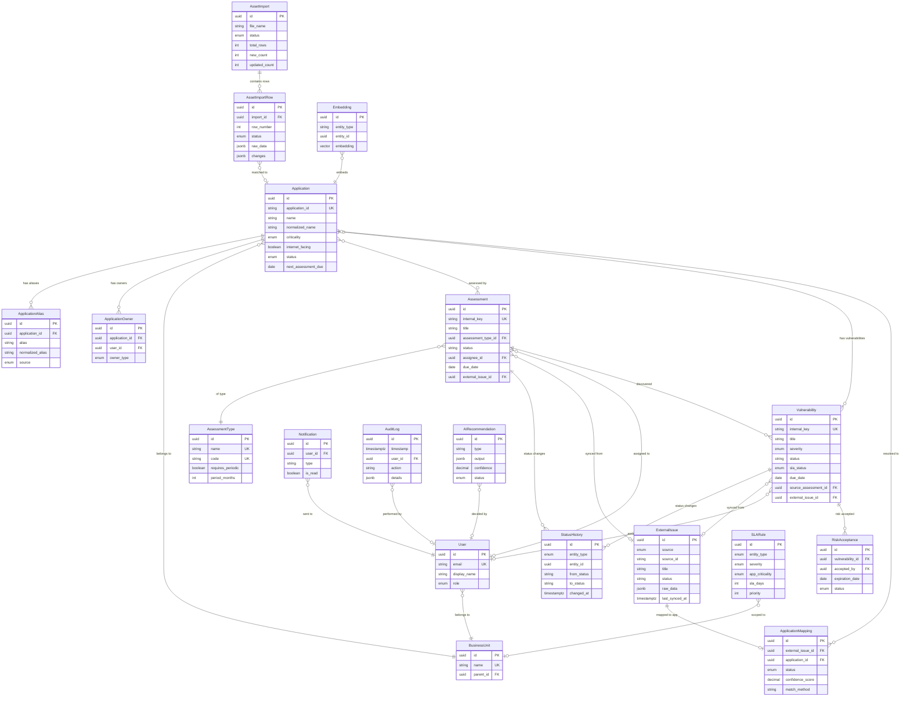

---

# PART L – Historical Data Strategy

## Problem

The platform must answer historical questions like "How many vulnerabilities were open at end of last month?" or "How has our SLA compliance changed over the past year?" Storing only current state makes these questions unanswerable.

## Recommended Approach: Event Sourcing Lite + Daily Snapshots

### Strategy 1: Status History Tables (MVP — Implemented)

Every status change for assessments and vulnerabilities is recorded in `StatusHistory`. Combined with `created_date` and timestamps on each status transition, this enables:

- Reconstructing state at any point in time
- Calculating time-in-status metrics
- Measuring mean time to remediate (MTTR)
- Generating status flow analytics

**Trade-off:** Reconstructing a "count of open vulns on date X" requires scanning all status history records and computing point-in-time state, which becomes expensive at scale.

### Strategy 2: Daily Snapshots (MVP — Implemented)

A nightly background job captures key metrics into a `DailySnapshot` table:

```
DailySnapshot
├── id: UUID
├── snapshot_date: DATE (PK with metric_type)
├── metric_type: ENUM (open_vulns, open_critical, sla_compliance, assessment_backlog, ...)
├── dimension: VARCHAR (e.g., business_unit:Finance, severity:Critical)
├── value: DECIMAL
├── details: JSONB (breakdown data)
├── created_at: TIMESTAMPTZ
```

**Snapshots captured nightly:**
- Open vulnerability count by severity
- Open vulnerability count by application
- Open vulnerability count by business unit
- SLA compliance percentage
- Assessment backlog by status
- Assessment coverage percentage
- Overdue assessment count
- Mean time to remediate (rolling)

**Trade-off:** Snapshots are simple to query but add storage. At the expected scale (tens of metrics × hundreds of dimensions × 365 days/year), this is negligible — ~100K rows per year.

### Strategy 3: Audit Log as Event Source

The `AuditLog` table records all significant actions with structured details in JSONB. While not a formal event store, it provides a chronological record that can be mined for historical analysis.

### What NOT to do in MVP

- **Temporal tables (SQL:2011):** PostgreSQL doesn't natively support temporal tables. Extensions like `temporal_tables` exist but add complexity. Not justified for MVP.
- **Full event sourcing:** Storing every domain event and rebuilding state from events is powerful but complex. Overkill for this use case.
- **Separate analytics warehouse:** A data warehouse (Snowflake, BigQuery) is unnecessary at MVP scale. If analytical query load impacts production performance, add a read replica first, then consider a warehouse in Phase 3.

### Recommended MVP Approach

1. **Status history tables** for fine-grained state reconstruction (assessment + vulnerability)
2. **Daily snapshot job** for efficient time-series dashboard queries
3. **Audit log** for event-level investigation
4. **Denormalized counters** on Application records (updated by triggers) for real-time dashboard performance

This combination provides:
- Real-time metrics (counters)
- Historical trends (snapshots)
- Detailed investigation (status history + audit)
- Compliance evidence (audit log)

---

# PART M – System Architecture

## Architecture Style: Modular Monolith

The platform is built as a **modular monolith**: a single deployable application with clearly separated internal modules. Each module has its own service layer, data access, and defined API boundaries, but they share a single database and deployment unit.

### Why Modular Monolith

| Factor | Monolith | Microservices |
|--------|----------|--------------|
| Team size (3–5) | ✅ Perfect fit | ❌ Overhead exceeds benefit |
| Deployment complexity | ✅ Single deployment | ❌ Multi-service orchestration |
| Data consistency | ✅ Single DB, transactions | ❌ Distributed transactions |
| Development speed | ✅ Fast iteration | ❌ Service boundary overhead |
| Operational burden | ✅ Minimal | ❌ Service mesh, monitoring per service |
| Future extraction | ✅ Clean modules → easy to extract | N/A |

### When to Consider Extraction

If in the future:
- A specific module needs independent scaling (e.g., AI processing)
- Different teams own different modules
- Deployment coupling becomes problematic

Then specific modules (likely the Integration Engine or Intelligence Engine first) can be extracted into separate services.

## Architecture Diagram

```mermaid
graph TB
    subgraph "Client Layer"
        Browser["Browser (React/Next.js)"]
    end

    subgraph "Application Layer (Modular Monolith)"
        subgraph "Next.js Application"
            FE["Frontend (React SSR + CSR)"]
            API["REST API Layer"]
        end
        
        subgraph "Service Modules"
            AssetSvc["Asset Management Service"]
            AssessSvc["Assessment Management Service"]
            VulnSvc["Vulnerability Management Service"]
            IntegSvc["Integration Engine"]
            IntelSvc["Intelligence Engine"]
            OpsSvc["Operations Service"]
            PlatSvc["Platform Services"]
        end
        
        subgraph "Cross-Cutting"
            Auth["Auth Middleware (OIDC)"]
            RBAC["RBAC Middleware"]
            Audit["Audit Service"]
            Jobs["Job Queue (BullMQ)"]
        end
    end

    subgraph "Data Layer"
        PG["PostgreSQL + pgvector"]
        Redis["Redis (Cache + Queue)"]
    end

    subgraph "External Services"
        SSO["Corporate SSO (OIDC)"]
        Jira["Jira Cloud API"]
        LLM["Claude API (Anthropic)"]
        SMTP["Email Service"]
    end

    subgraph "Background Workers"
        SyncWorker["Jira Sync Worker"]
        ImportWorker["Import Worker"]
        SLAWorker["SLA Calculator"]
        AIWorker["AI Processing Worker"]
        NotifWorker["Notification Worker"]
        SnapWorker["Snapshot Worker"]
    end

    Browser --> FE
    FE --> API
    API --> Auth
    Auth --> SSO
    Auth --> RBAC
    API --> AssetSvc
    API --> AssessSvc
    API --> VulnSvc
    API --> IntegSvc
    API --> IntelSvc
    API --> OpsSvc
    API --> PlatSvc
    
    AssetSvc --> PG
    AssessSvc --> PG
    VulnSvc --> PG
    IntegSvc --> PG
    IntelSvc --> PG
    OpsSvc --> PG
    PlatSvc --> PG
    
    AssetSvc --> Redis
    IntegSvc --> Redis
    IntelSvc --> Redis
    
    IntegSvc --> Jira
    IntelSvc --> LLM
    
    Jobs --> Redis
    Jobs --> SyncWorker
    Jobs --> ImportWorker
    Jobs --> SLAWorker
    Jobs --> AIWorker
    Jobs --> NotifWorker
    Jobs --> SnapWorker
    
    SyncWorker --> Jira
    SyncWorker --> PG
    ImportWorker --> PG
    SLAWorker --> PG
    AIWorker --> LLM
    AIWorker --> PG
    NotifWorker --> SMTP
    NotifWorker --> PG
    SnapWorker --> PG
    
    RBAC --> PG
    Audit --> PG
```

## Technology Stack

| Layer | Technology | Justification |
|-------|-----------|--------------|
| **Frontend** | Next.js 14+ (App Router), React 18+, TypeScript | SSR for initial load, CSR for interactivity, great DX |
| **UI Components** | shadcn/ui + Tailwind CSS | Accessible, customizable, no vendor lock-in |
| **Charts** | Recharts or Tremor | React-native charting, suitable for dashboards |
| **State Management** | TanStack Query (React Query) | Server state management, caching, refetching |
| **Backend** | Next.js API Routes + Service Layer | Unified deployment, TypeScript end-to-end |
| **ORM** | Prisma or Drizzle ORM | Type-safe database access, migrations |
| **Database** | PostgreSQL 16 + pgvector | Relational integrity + vector search |
| **Cache/Queue** | Redis 7 | Session cache, query cache, job queue backend |
| **Job Queue** | BullMQ | Reliable job processing, retry, scheduling |
| **Search** | PostgreSQL FTS (MVP) | Built-in, no additional infra |
| **AI/LLM** | Anthropic Claude API (Sonnet for most tasks, Haiku for simple classification) | Best reasoning quality, structured output |
| **Embeddings** | Anthropic/OpenAI embedding models → pgvector | Integrated vector storage |
| **Auth** | NextAuth.js / Auth.js with OIDC provider | Corporate SSO integration |
| **File Parsing** | ExcelJS or SheetJS | xlsx parsing |
| **Validation** | Zod | Runtime type validation |
| **Logging** | Pino | Structured JSON logging |
| **Metrics** | prom-client (Prometheus) | Standard metrics exposure |
| **Tracing** | OpenTelemetry SDK | Distributed tracing |
| **Testing** | Vitest (unit), Playwright (E2E) | Fast, TypeScript-native |

## Module Responsibilities

| Module | Responsibility | Key Operations |
|--------|---------------|---------------|
| Asset Management | Application CRUD, aliases, owners, inventory queries | Create/update/search applications |
| Assessment Management | Assessment lifecycle, type management, assignment | Create/update assessments, manage workflow |
| Vulnerability Management | Finding lifecycle, SLA, risk acceptance, verification | Create/update vulns, calculate SLA |
| Integration Engine | External system adapters, sync orchestration, field mapping | Jira sync, Excel import, field normalization |
| Intelligence Engine | AI operations, entity resolution, NLQ, recommendations | Analyze tickets, resolve apps, answer questions |
| Operations Console | Dashboards, search, notifications, reporting | Aggregate metrics, deliver notifications |
| Platform Services | Auth, RBAC, audit, users, configuration | Authenticate, authorize, log, configure |

---

# PART N – Integration Architecture

## Adapter Pattern

The platform uses an **Integration Adapter Layer** to decouple the internal domain from external systems. Each external system is accessed through an adapter that normalizes its data into internal domain concepts.

```
┌─────────────────────────────────────────────────┐
│              Internal Domain                     │
│  Application, Assessment, Vulnerability          │
│                                                  │
│         ┌─────────────────────────┐              │
│         │  Integration Service    │              │
│         │  (Orchestration Layer)  │              │
│         └─────────┬───────────────┘              │
│                   │                              │
│    ┌──────────────┼──────────────────┐           │
│    │              │                  │           │
│ ┌──┴──┐      ┌───┴──┐         ┌────┴────┐      │
│ │Jira │      │Excel │         │ Future  │      │
│ │Adapt│      │Adapt │         │ Adapter │      │
│ └──┬──┘      └───┬──┘         └────┬────┘      │
└────┼─────────────┼─────────────────┼────────────┘
     │             │                 │
┌────┴───┐   ┌────┴───┐       ┌────┴────────┐
│ Jira   │   │ Excel  │       │ ServiceNow, │
│ Cloud  │   │ Files  │       │ Snyk, etc.  │
└────────┘   └────────┘       └─────────────┘
```

## Adapter Interface

Each adapter implements a common interface:

```typescript
interface IntegrationAdapter {
  // Identity
  readonly source: ExternalSource; // 'jira' | 'servicenow' | 'snyk' | ...
  readonly name: string;
  
  // Lifecycle
  testConnection(): Promise<ConnectionStatus>;
  
  // Data Operations
  fetchIssues(since?: Date, options?: FetchOptions): AsyncIterable<ExternalIssueDTO>;
  fetchIssueById(externalId: string): Promise<ExternalIssueDTO>;
  
  // Field Mapping
  mapToInternalAssessment(external: ExternalIssueDTO): Partial<AssessmentDTO>;
  mapToInternalVulnerability(external: ExternalIssueDTO): Partial<VulnerabilityDTO>;
  mapStatusToInternal(externalStatus: string): string;
  
  // Write-back (optional)
  updateIssue?(externalId: string, changes: ExternalIssueUpdate): Promise<void>;
  addComment?(externalId: string, comment: string): Promise<void>;
}
```

## Integration Service (Orchestration)

The Integration Service orchestrates sync operations regardless of the source:

1. **Receive trigger** (scheduled, manual, webhook)
2. **Call adapter** to fetch external data
3. **Store raw data** in `ExternalIssue` table
4. **Trigger application resolution** via Intelligence Engine
5. **Map to internal entities** (Assessment or Vulnerability)
6. **Detect changes** and apply updates
7. **Record status transitions** in history
8. **Log sync metadata** in `JiraSyncHistory`

This design means adding a new source (e.g., ServiceNow) requires only:
1. Implementing a new adapter conforming to the interface
2. Configuring field and status mappings
3. No changes to the core domain logic

## Normalized Internal Model

The `ExternalIssue` table stores a normalized representation of external data:
- `source` — identifies which system
- `source_id` — the external ID
- `custom_fields` — JSONB for system-specific fields
- `raw_data` — full payload for debugging

Internal entities (Assessment, Vulnerability) reference `ExternalIssue` but do not contain Jira-specific fields. The separation means:
- Internal status workflows are independent of Jira workflows
- Field names are internal domain terms, not Jira field names
- Multiple sources can feed the same internal entities

---

# PART O – Jira Integration Design

## Authentication

- **Primary:** OAuth 2.0 (3LO) for Jira Cloud — recommended for production
- **Fallback:** API tokens (basic auth) for initial development
- Credentials stored in secrets manager (e.g., HashiCorp Vault, AWS Secrets Manager, or encrypted environment variables)
- Token refresh handled automatically with retry on 401

## API Strategy

- Use Jira REST API v3 (Cloud) or v2 (Server/Data Center)
- Use JQL (Jira Query Language) for filtered queries
- Request only needed fields via `fields` parameter to reduce payload
- Use `expand` parameter selectively

## Synchronization Design

### Recommended: Hybrid (Polling + Webhooks)

| Approach | Pros | Cons |
|----------|------|------|
| **Polling only** | Simple, reliable, works without Jira admin access | Latency (minutes), API quota consumption |
| **Webhooks only** | Real-time, efficient | Unreliable delivery, requires Jira admin, no catch-up |
| **Hybrid** ✅ | Real-time + reliable baseline | Slightly more complex |

**Hybrid approach:**
1. **Scheduled polling** (every 15 minutes): Incremental sync using `updated >= lastSyncTime` JQL. This is the reliable baseline that catches everything.
2. **Webhooks** (real-time): Jira sends events for issue create/update/delete. These trigger immediate processing for near-real-time updates.
3. **Full sync** (nightly): Complete reconciliation to catch any missed updates. Uses pagination to process all issues.

### Incremental Sync Flow

```
1. Read last sync watermark (timestamp)
2. JQL: project = SEC AND updated >= "watermark" ORDER BY updated ASC
3. Paginate results (50 per page via startAt/maxResults)
4. For each issue:
   a. Upsert into ExternalIssue (keyed on source + source_id)
   b. Detect changes vs. previous ExternalIssue record
   c. If changed: trigger internal entity update
   d. Trigger application resolution if unmapped
5. Update watermark to max(issue.updated)
6. Record sync history
```

### Pagination

- Use `startAt` and `maxResults` (max 100 per Jira API)
- Process pages sequentially to respect rate limits
- Track progress for resumability

### Rate Limiting

- Jira Cloud: typically 100 requests per minute per user
- Implement token bucket rate limiter
- Read `X-RateLimit-*` and `Retry-After` headers
- Exponential backoff: 1s → 2s → 4s → 8s → 16s (max)

### Retry Policy

| Error Type | Action |
|-----------|--------|
| 429 (Rate Limit) | Wait for Retry-After header, then retry |
| 5xx (Server Error) | Retry up to 3 times with exponential backoff |
| 401 (Auth) | Refresh token, retry once |
| 4xx (Client Error) | Log error, skip issue, continue sync |
| Network Error | Retry up to 3 times with backoff |
| Timeout | Retry with increased timeout, up to 2 times |

### Handling Edge Cases

**Deleted Jira issues:**
- Jira API doesn't easily surface deletions
- Nightly full sync: compare current Jira issue set against ExternalIssue records
- Issues in our DB but not in Jira: mark ExternalIssue as `sync_status = 'deleted'`
- Do NOT delete internal Assessment/Vulnerability records — mark them as "source deleted" and flag for review

**Jira field changes:**
- Field mapping is stored as configuration, not code
- Admin can update field mappings without deployment
- Unknown fields stored in `custom_fields` JSONB for flexibility

**Jira workflow changes:**
- Status mapping is configurable: `{ "Done": "completed", "In Review": "in_progress" }`
- Unmapped statuses are stored as-is and flagged for admin review
- Status mapping changes are audited

**Custom Jira fields:**
- Map via field ID (e.g., `customfield_10123`)
- Store in `custom_fields` JSONB on ExternalIssue
- Admin configures which custom fields map to internal fields

### Webhook Design

- Register webhooks for: `jira:issue_created`, `jira:issue_updated`, `jira:issue_deleted`
- Webhook endpoint validates Jira signature
- Events are enqueued to the job queue for processing (not processed synchronously)
- Deduplication: if polling processes the same update, the result is idempotent (upsert by source_id)

### Write-back (Phase 2)

Write-back operations require explicit user approval:
- Assign Jira issue → requires manager click
- Add Jira comment → shows preview, user confirms
- Update Jira status → shows current and proposed status, user confirms

All write-backs are:
- Logged in audit trail
- Rate-limited
- Retried on failure
- Reversible where possible (e.g., comment can be deleted)

---

# PART P – Excel Import Design

## Import Pipeline

### Step 1: Upload

- Accept `.xlsx` files only (not `.xls`, `.csv` — can be added later)
- Max file size: 50MB
- Validate MIME type and file extension
- Compute SHA-256 hash (detect duplicate uploads)
- Store original file for audit
- Create `AssetImport` record with status `uploaded`

### Step 2: Column Mapping

- Parse header row from Excel
- Present column mapping UI: Excel column → internal field
- Support saved column mapping templates (common mappings)
- Allow unmapped columns (ignored)
- Require mapping for at least: Application ID or Name, Business Unit

### Step 3: Data Validation

For each row, validate:

| Validation | Rule |
|-----------|------|
| Required fields | Application ID and Name must be present |
| Data types | Dates must parse, enums must match allowed values |
| Length limits | Names ≤ 255 chars, etc. |
| URL format | URLs must be valid if provided |
| Enum values | Criticality must be Critical/High/Medium/Low |
| Referential | Business Unit should exist (warning if not) |
| Uniqueness | No duplicate Application IDs within the file |

Invalid rows get detailed error messages. The user can fix the Excel and re-upload, or exclude invalid rows from import.

### Step 4: Data Normalization

- Trim whitespace from all string fields
- Normalize application names: lowercase, remove extra spaces, standardize punctuation
- Standardize date formats to ISO 8601
- Standardize enum values (case-insensitive matching)
- Normalize URLs (add scheme if missing)

### Step 5: Identity Resolution

For each row, determine whether it matches an existing application:

**Matching priority:**
1. **Application ID match** — if the row has an Application ID that matches an existing record, it's the same application (strongest)
2. **Normalized name exact match** — normalized name matches an existing application
3. **Alias match** — row name matches a known alias
4. **Fuzzy match with high confidence** — name similarity > 90% AND same business unit AND same owner → likely match, flag for confirmation
5. **No match** — new application

**Duplicate detection within file:**
- Rows with the same Application ID → error
- Rows with very similar names → warning with suggestion to review

### Step 6: Change Comparison

For matched rows (identity resolved), compare each field:
- Generate field-level diff: `{ field: "criticality", old: "Medium", new: "High" }`
- Store diff in `AssetImportRow.changes`
- Classify row as UPDATED only if at least one field changed

For unmatched rows in the database but not in the file:
- Classify as REMOVED
- Do NOT auto-delete — flag for review

### Step 7: Preview

Present to user:
- Summary counts (new, updated, unchanged, invalid, duplicate, removed)
- Table of changes with color coding
- Expandable row detail showing field-level changes
- Validation errors with row numbers
- Ability to include/exclude specific rows
- "Download preview report" option

### Step 8: Import (User Confirms)

- Execute in a database transaction
- Create new Application records for NEW rows
- Update fields on existing records for UPDATED rows
- Record the import_id on all touched Application records
- Create StatusHistory / AuditLog entries for all changes
- Mark REMOVED applications as "not in latest import" (do not auto-decommission)
- Update `AssetImport` status to `completed`

### Step 9: Audit & Report

- Record detailed audit log entry for the import
- Generate import report (viewable in UI, downloadable)
- Report includes: file name, user, timestamp, all counts, all changes, all errors

### Rollback

- Within a configurable window (e.g., 24 hours), admin can rollback an import
- Rollback uses the `AssetImportRow.changes` diffs to reverse updates
- New applications created by the import are soft-deleted
- Rollback is itself audited

---

# PART Q – Application Resolution Engine

## Overview

The Application Resolution Engine is the core data quality capability of the platform. It resolves the question: *"Which internal application does this external ticket/issue belong to?"*

## Full Matching Pipeline

### Stage 1: Candidate Generation

Generate a broad set of potential application matches from multiple sources:

1. **Extract references from ticket**
   - Parse title for potential application names
   - Parse description for application names, URLs, repository links
   - Extract Jira labels and components
   - Extract reporter's team/BU

2. **Query candidates**
   - Exact query against `application.application_id` (if ticket contains an ID)
   - Exact query against `application.name` and `application_alias.alias`
   - Fuzzy query against `application.normalized_name` (trigram similarity via pg_trgm)
   - Component mapping table: Jira component → application
   - Reporter's BU → applications owned by that BU
   - Repository URL match if ticket mentions a repo
   - Embedding similarity search against application name embeddings

### Stage 2: Deterministic Scoring

For each candidate, compute a deterministic score:

| Signal | Score | Condition |
|--------|-------|-----------|
| Exact Application ID match | 100 | Ticket contains `APP-0142` and app has that ID |
| Exact name match | 95 | Ticket title contains exact application name |
| Exact alias match | 90 | Ticket text matches a known alias |
| Jira component mapping | 90 | Component has a confirmed app mapping |
| Historical confirmed mapping | 85 | Same reporter + same text pattern confirmed before |
| Repository URL match | 85 | Ticket mentions app's repository URL |
| Normalized name match (>95% similarity) | 80 | Trigram similarity |
| Owner/reporter match | +15 | Reporter is in same BU as application owner |
| Same BU | +10 | Reporter's BU matches application's BU |
| Fuzzy name match (80-95%) | 60–75 | Partial string match |
| Multiple weak signals | Sum | Combine metadata matches |

### Stage 3: AI Re-ranking (Conditional)

**When invoked:** When no candidate scores ≥ 90% or when multiple candidates are close in score.

**Input to LLM:**
```
Ticket: { title, description (truncated), labels, components, reporter team }
Candidate Applications: [
  { name, aliases, business_unit, technology_stack, description, score, evidence }
]
Task: Which application does this ticket most likely refer to?
Return: { application_name, confidence, evidence, reasoning, alternatives }
```

**Important controls:**
- Ticket description is treated as untrusted input — wrapped in clear delimiters
- LLM output is parsed as structured JSON (tool_use / structured output)
- LLM cannot override a 100-score exact ID match
- LLM confidence is combined with deterministic score, not used alone

### Stage 4: Confidence Calculation

Final confidence = weighted combination of:
- Deterministic score (weight: 0.6)
- AI confidence, if used (weight: 0.3)
- Historical accuracy for this match pattern (weight: 0.1)

### Stage 5: Decision

| Final Confidence | Evidence Quality | Action |
|-----------------|-----------------|--------|
| ≥ 95% | Exact ID, exact name, or exact alias match | **Auto-link** — no human review |
| 90–95% | Strong deterministic + AI confirmation | **Auto-link** — log for spot-check |
| 80–90% | Good signal but not definitive | **Recommend** — add to review queue, show evidence |
| 70–80% | Mixed signals | **Suggest** — add to review queue, show alternatives |
| < 70% | Weak or no signal | **Manual review required** — show all candidates |

**Challenge to the proposed 95% auto-link threshold:** I recommend 90% for auto-linking when supported by **deterministic evidence** (exact ID, exact alias, confirmed component mapping). Pure fuzzy/AI matches should require 95%+ for auto-linking. This policy produces better throughput without sacrificing accuracy because deterministic matches are verifiable.

### Stage 6: Feedback Loop

When a human confirms or overrides a mapping:

1. **Record the decision** in `ApplicationMapping` with evidence
2. **Learn new alias** if the ticket used a name that wasn't in aliases
   - Automatically add as alias with source `ai_learned`
   - Require confirmation for aliases that are very different from known names
3. **Update historical patterns** — "Reporter X from Team Y usually means Application Z"
4. **Improve future scoring** — confirmed mappings increase the historical bonus for similar patterns

### Example Walkthrough

**Ticket:** `SEC-1234: "Security Review - Payment API v2"`  
**Reporter:** John Smith, Finance team

**Stage 1 — Candidate Generation:**
- Extract "Payment API v2" from title
- Query fuzzy: "payment api" → candidates:
  - Payment Gateway (APP-0142), alias: "Payment API"
  - Payment Processing Service (APP-0298)
  - Payment Reconciliation (APP-0301)

**Stage 2 — Deterministic Scoring:**
- Payment Gateway: alias "Payment API" matches → 90 + reporter in Finance (matches BU) → +10 + 3 previous tickets from reporter mapped here → +30 (historical) = **effectively very high**
- Payment Processing Service: fuzzy "payment" → 40 + different BU → no bonus = **40**
- Payment Reconciliation: fuzzy "payment" → 35 = **35**

**Stage 3 — AI not needed** (clear winner)

**Result:** Auto-link to Payment Gateway, confidence 95%, evidence: "Exact alias match 'Payment API', reporter's team matches application BU, 3 historical confirmations."

### False Match Detection and Correction

- **Spot-check queue:** A configurable percentage (e.g., 10%) of auto-linked matches are randomly added to the review queue for quality assurance
- **False match report:** Users can flag any mapping as incorrect from the Assessment or Vulnerability detail page
- **Impact:** When a false match is reported:
  1. Mapping is reverted
  2. If an alias was auto-learned from this mapping, it's removed
  3. The pattern is recorded as a "negative example"
  4. Matching accuracy metrics are updated

---

# PART R – SLA Engine

## Design Principles

1. **Rule-driven, not hardcoded** — SLA logic is configuration, not code
2. **Versioned** — Rule changes are tracked; old vulnerabilities retain the SLA that was active when they were created
3. **Most-specific-wins** — When multiple rules apply, the most specific rule takes precedence
4. **Auditable** — SLA calculations can be explained and traced to rules

## Rule Structure

SLA rules are stored in the `SLARule` table. Each rule defines:
- **Conditions:** What it matches (severity, criticality, internet-facing, BU, etc.)
- **SLA:** How many days allowed
- **Priority:** Specificity ranking (higher = more specific)

### Rule Resolution Algorithm

When calculating SLA for a vulnerability:

```
1. Gather context: vulnerability.severity, application.criticality,
   application.internet_facing, application.business_unit,
   application.compliance_scope, vulnerability.environment

2. Find all active SLARule records where:
   - entity_type = 'vulnerability'
   - effective_from <= today AND (effective_to IS NULL OR effective_to >= today)
   - All non-null conditions match the context
     (null condition = applies to all values for that dimension)

3. Sort matching rules by priority DESC (most specific first)

4. Select the first (highest priority) rule

5. Calculate due_date = vulnerability.created_date + rule.sla_days
```

### Example Rule Set

| Rule | Severity | Criticality | Internet | SLA Days | Priority |
|------|---------|------------|---------|----------|----------|
| Default Critical | Critical | * | * | 7 | 10 |
| Default High | High | * | * | 30 | 10 |
| Default Medium | Medium | * | * | 60 | 10 |
| Default Low | Low | * | * | 90 | 10 |
| Critical + Internet-facing | Critical | * | Yes | 3 | 20 |
| Critical + Critical App | Critical | Critical | * | 5 | 20 |
| Critical + Critical + Internet | Critical | Critical | Yes | 1 | 30 |
| PCI Compliance | * | * | * | * | 15 |

*Note: PCI Compliance rules would have their own severity-specific sub-rules.*

For a Critical vulnerability on an internet-facing, Critical-criticality application: Rule "Critical + Critical + Internet" wins (priority 30) → SLA = 1 day.

### SLA Status Calculation

Calculated by the SLA Worker (runs every hour) and cached on the Vulnerability record:

| Status | Condition |
|--------|-----------|
| `on_track` | due_date is in the future, > warning threshold |
| `at_risk` | due_date is within warning_days_before (default 3 days) |
| `breached` | due_date has passed and vulnerability is still open |
| `paused` | SLA clock is paused (e.g., waiting on vendor) |
| `exempt` | Vulnerability has active risk acceptance |
| `met` | Vulnerability was resolved within SLA |
| `missed` | Vulnerability was resolved after SLA breach |

### SLA Clock Management

- **Start:** SLA clock starts at `vulnerability.created_date`
- **Pause (Phase 2):** When status changes to a "paused" state (e.g., "Waiting for Vendor"), elapsed time stops counting. Requires: `sla_paused_at`, `sla_paused_duration_days` fields
- **Resume:** Clock resumes when status leaves the paused state. Due date is extended by paused duration
- **Exempt:** Risk acceptance pauses SLA and marks as exempt until expiration
- **Reset:** Reopened vulnerabilities get a new SLA based on reopen date

### Rule Versioning

- SLA rules have `effective_from` and `effective_to` dates
- When rules change, old rules are marked with `effective_to = today`
- New rules are created with `effective_from = tomorrow`
- **Existing vulnerabilities are NOT retroactively affected** — they retain the SLA that was in effect when created (or the rule that was active at their created_date can be looked up by date range)
- All rule changes are recorded in the audit log with before/after state
- Admin UI shows rule change history

### SLA Recalculation Job

Runs hourly (configurable):
1. Query all open vulnerabilities
2. For each, evaluate current SLA status
3. If status changed (e.g., on_track → at_risk), update the record
4. If newly at_risk or breached, queue notification
5. Update denormalized SLA metrics on Application records

---

# PART S – AI Architecture

## AI Gateway

All AI operations go through a centralized AI Gateway service within the monolith. This provides:

- **Model abstraction:** Swap models without changing business logic
- **Rate limiting:** Control AI API costs and throughput
- **Retry logic:** Handle LLM API failures gracefully
- **Audit logging:** Log every AI request/response
- **Token tracking:** Monitor and budget token usage
- **Prompt management:** Version-controlled prompt templates
- **Input sanitization:** Strip/escape untrusted content before prompting
- **Output parsing:** Validate and parse structured AI outputs
- **Caching:** Cache identical requests to reduce cost

```typescript
interface AIGateway {
  // Core operations
  analyze(request: AIRequest): Promise<AIResponse>;
  embed(texts: string[]): Promise<number[][]>;
  
  // Specific capabilities
  analyzeTicket(ticket: TicketAnalysisInput): Promise<TicketAnalysisOutput>;
  resolveApplication(context: AppResolutionInput): Promise<AppResolutionOutput>;
  recommendAssignment(context: AssignmentInput): Promise<AssignmentOutput>;
  answerQuestion(question: NLQueryInput): Promise<NLQueryOutput>;
  generateBrief(context: BriefInput): Promise<BriefOutput>;
  summarizeAppSecurity(appId: string): Promise<SecuritySummaryOutput>;
}
```

## AI Capability Matrix

| Capability | AI Level | Model | Trigger | Human Approval |
|-----------|---------|-------|---------|---------------|
| Ticket Analysis | L1 (Read/Summarize) | Sonnet | On sync | No |
| Application Resolution | L2 (Recommend) | Sonnet | On sync | Yes (< 90% confidence) |
| Assignment Recommendation | L2 (Recommend) | Sonnet | On request | Yes (always) |
| App Security Summary | L1 (Read/Summarize) | Haiku | On page view | No |
| NL Query | L1 (Read/Summarize) | Sonnet | On request | No |
| Daily Brief | L1 (Read/Summarize) | Sonnet | Scheduled | No |
| Priority Recommendation | L2 (Recommend) | Haiku | On request | No (advisory only) |
| Jira Comment Draft | L3 (Prepare Action) | Sonnet | On request | Yes (before send) |
| Jira Assignment | L4 (Execute after approval) | N/A (deterministic) | On approval | Yes (always) |

## Ticket Analyzer

**Input:** Jira ticket title, description, labels, components, reporter, metadata  
**Output:**
```json
{
  "summary": "Request for periodic security review of the Payment Gateway service",
  "likely_application": "Payment Gateway",
  "assessment_type": "periodic_security_assessment",
  "requested_work": "Periodic security review including OWASP testing",
  "priority_indicators": ["contains PCI data", "internet-facing"],
  "complexity": "medium",
  "required_skills": ["web_security", "api_security", "payment_systems"],
  "missing_information": ["target environment", "preferred schedule"],
  "confidence": 0.88
}
```

**Safety:** Ticket description is treated as untrusted input. The prompt separates the instruction (system prompt) from the data (user message with clear delimiters). The LLM is instructed to analyze, not to follow instructions found in the ticket.

## Application Resolver (AI Component)

Described in detail in Part Q. The AI component:
- Receives candidate applications with deterministic scores
- Analyzes ticket context against each candidate
- Returns ranked candidates with explanations
- Does NOT make the final decision alone — combined with deterministic scoring

## Assignment Recommender

**Input:**
- Assessment details (type, priority, application, technology)
- Engineer profiles (current workload, skills, availability, history)

**Processing:**
1. **Deterministic scoring** (80% of decision):
   - Workload score: inverse of current severity-weighted active items
   - Skill match: overlap between required skills and engineer skills
   - Familiarity: has engineer assessed this application before?
   - Availability: is engineer on PTO or at capacity?

2. **AI interpretation** (20%):
   - LLM reviews the top 3 candidates and provides natural language explanation
   - Explanation includes: why each candidate is suitable, risks of assignment
   - LLM does NOT override deterministic ranking, only explains it

**Output:**
```json
{
  "recommended_engineer": "Maria Chen",
  "score": 87,
  "explanation": "Maria has the lowest current workload (2 active assessments vs team avg 3.5) and has assessed Payment Gateway twice before, providing valuable application familiarity.",
  "alternatives": [
    { "engineer": "James Park", "score": 72, "reason": "Good skills match but higher current workload" }
  ],
  "workload_snapshot": { ... }
}
```

## Security Q&A (Natural Language Query)

Detailed in Part T below.

## Daily Security Brief

**Generation process (scheduled, 7 AM daily):**

1. **Deterministic metrics calculation** (not AI):
   - New vulnerabilities (last 24h) by severity
   - SLA breaches (new and total active)
   - Assessments completed yesterday
   - Assessments waiting for assignment
   - Near-SLA vulnerabilities (≤ 3 days)
   - Applications with new Critical findings

2. **AI insight generation:**
   - Feed the metrics to LLM
   - LLM generates 3–5 **actionable insights** (not just restating numbers)
   - Each insight is grounded in specific data points
   - Example: "Payment Gateway has accumulated 3 unresolved Critical findings over 2 weeks — consider escalation"

3. **Output:**
   - Structured metrics section (deterministic, always accurate)
   - AI insights section (labeled as AI-generated)
   - Each insight links to the underlying data
   - Brief can be personalized by role (executive sees summary, engineer sees their items)

**Hallucination prevention:**
- AI receives actual metrics data, not memory/training data
- AI is instructed to only reference data provided in the prompt
- Metrics section is always deterministic
- AI insights are validated: referenced entity IDs must exist

## Embedding Service

**Purpose:** Generate vector embeddings for semantic search and entity resolution.

**What gets embedded:**
- Application name + description + aliases → one embedding per application
- Assessment title + description → one embedding per assessment
- Vulnerability title + description → one embedding per vulnerability

**Model:** Use a dedicated embedding model (e.g., `text-embedding-3-small` from OpenAI or equivalent Anthropic embedding)

**Storage:** pgvector extension in PostgreSQL — no separate vector database needed for MVP scale.

**Staleness management:**
- Each embedding stores a `content_hash` of its source text
- Background job checks for stale embeddings (content changed since last embedding)
- Re-embed stale records in batch

**When embeddings are used:**
- Application resolution: find semantically similar application names
- Similar vulnerability search: find past vulns similar to a new one
- NLQ: find relevant context for answering questions

## RAG (Retrieval-Augmented Generation)

**Where RAG is used:**
- NLQ: Retrieve relevant schema documentation, metric definitions, and example queries before generating SQL
- App security summary: Retrieve recent assessment and vulnerability data for the application
- Daily brief: Retrieve relevant context beyond simple metrics

**RAG flow:**
1. Query → generate embedding
2. Search pgvector for relevant documents/records
3. Also search structured data (SQL queries) for factual data
4. Combine retrieved context into LLM prompt
5. LLM generates answer grounded in retrieved context

## Human Approval Flow

For Level 3–4 AI actions:

```
AI generates recommendation
→ Store in AIRecommendation table (status: pending)
→ Notify user (in-app notification)
→ User reviews recommendation with evidence
→ User clicks Approve / Reject
→ If Approve:
    → Execute action (e.g., update Jira)
    → Update AIRecommendation status: accepted
    → Audit log
→ If Reject:
    → Update AIRecommendation status: rejected
    → Store rejection reason
    → Audit log
```

## AI Audit Trail

Every AI operation records:

| Field | Description |
|-------|------------|
| type | ticket_analysis, app_resolution, assignment, query, summary |
| input_summary | Summarized input (not raw — may contain sensitive data) |
| model_provider | anthropic |
| model_id | claude-sonnet-4-6 |
| prompt_template | Template version used |
| output | Full structured output |
| confidence | Overall confidence score |
| tokens_used | Input + output tokens |
| latency_ms | Response time |
| status | pending, accepted, rejected, expired |
| user_decision | What the human decided |

---

# PART T – Natural Language Analytics

## Architecture

The NLQ system uses a **hybrid approach**: predefined metrics for common questions, Text-to-SQL for ad-hoc queries, with safety guardrails throughout.

### Approach Comparison

| Approach | Pros | Cons | Recommendation |
|----------|------|------|---------------|
| **Predefined metric APIs** | Always accurate, fast, no SQL risk | Limited flexibility | Use for common KPIs |
| **Text-to-SQL** | Flexible, any question | SQL injection risk, hallucination, wrong queries | Use with heavy guardrails |
| **Semantic model** | Structured data abstraction | Upfront modeling effort | Phase 2 |
| **RAG only** | Good for document Q&A | Poor for numerical/aggregation queries | Use for context, not as primary |

**MVP recommendation:** Predefined metrics (70% of queries) + guarded Text-to-SQL (30%)

### Query Flow

```
1. User submits question
2. Authentication check — is user logged in?
3. Permission check — what data can this user access?
4. Intent classification (LLM):
   - METRIC: Maps to a known KPI → route to predefined query
   - DATA_QUERY: Needs custom query → route to Text-to-SQL
   - EXPLANATION: Needs context → route to RAG + summarize
   - CLARIFICATION: Ambiguous → ask user to rephrase
   - OUT_OF_SCOPE: Not about security data → politely decline

5a. METRIC path:
   - Map to predefined metric function
   - Extract parameters (date range, filters)
   - Execute parameterized query
   - Return structured result

5b. DATA_QUERY path:
   - Provide LLM with:
     - Database schema documentation (table names, columns, relationships)
     - Metric definitions (what "open" means, what "SLA breached" means)
     - User's permission scope (which BUs, which apps)
     - Example queries for similar questions
   - LLM generates SQL
   - Validate SQL (see safety checks below)
   - Execute on read-only connection with:
     - 5-second timeout
     - 1,000 row limit
     - Transaction isolation: READ COMMITTED
   - Return results

6. Result formatting:
   - LLM generates natural language explanation
   - Attach: source query/metric, tables used, filter period, last sync time
   - User can click "View Query" to see the SQL or metric definition
```

### Predefined Metrics

Common questions map to predefined, tested queries:

| Intent Pattern | Metric | Query |
|---------------|--------|-------|
| "How many vulns [created/opened] in [period]" | vuln_created_count | SELECT COUNT(*) FROM vulnerability WHERE created_date BETWEEN $1 AND $2 |
| "How many [severity] vulns are open" | open_vuln_by_severity | SELECT severity, COUNT(*) FROM vulnerability WHERE status NOT IN ('closed','false_positive',...) GROUP BY severity |
| "Which apps have most vulns" | top_apps_by_vuln | SELECT app.name, COUNT(*) FROM vulnerability_application va JOIN ... GROUP BY ... ORDER BY count DESC LIMIT 10 |
| "Which apps haven't been assessed in [period]" | overdue_assessment | SELECT * FROM application WHERE next_assessment_due < NOW() |
| "Who has highest workload" | engineer_workload | Complex query across assessments + vulnerabilities grouped by assignee |

### Text-to-SQL Safety

| Guard | Implementation |
|-------|---------------|
| Read-only connection | Separate DB user with SELECT-only grants |
| Allowed tables | Whitelist of queryable tables (no audit_log, no user credentials) |
| Allowed operations | Only SELECT (reject INSERT, UPDATE, DELETE, DROP, ALTER, TRUNCATE) |
| No subqueries to sensitive tables | Parse SQL AST, reject queries touching disallowed tables |
| Row limit | LIMIT 1000 appended if not present |
| Timeout | 5-second query timeout |
| Permission filter | Automatically inject WHERE clauses for user's BU/app scope |
| SQL injection | Parameterize any user-provided literals |
| Dry-run validation | EXPLAIN the query before executing (catches syntax errors, estimates cost) |
| Cost check | Reject queries with estimated cost > threshold |

### Permission-Aware Querying

The NLQ system must enforce RBAC:
- A Security Engineer asking "show my vulnerabilities" sees only their assigned items
- An App Owner asking "show vulnerabilities" sees only their applications' vulnerabilities
- A Security Manager sees all data within their BU
- An Executive sees all data (read-only)

Implementation: The intent classifier detects scope ("my", "team", specific app names). The query generator injects permission filters based on the user's role and scope.

---

# PART U – Search Architecture

## MVP: PostgreSQL-Based Search

### Structured Search

Standard database queries with WHERE clauses:
- Exact match on IDs, keys, enum values
- LIKE/ILIKE for partial string matching
- Filter combinations (AND/OR)
- Sorted, paginated results

### Full-Text Search (PostgreSQL FTS)

Using PostgreSQL's built-in `tsvector` and `tsquery`:

```sql
-- Create search vectors (maintained via trigger)
ALTER TABLE application ADD COLUMN search_vector tsvector;
CREATE INDEX idx_app_search ON application USING GIN(search_vector);

-- Populate
UPDATE application SET search_vector = 
  setweight(to_tsvector('english', coalesce(name, '')), 'A') ||
  setweight(to_tsvector('english', coalesce(description, '')), 'B') ||
  setweight(to_tsvector('english', coalesce(application_id, '')), 'A');

-- Query
SELECT * FROM application 
WHERE search_vector @@ plainto_tsquery('english', 'payment gateway')
ORDER BY ts_rank(search_vector, plainto_tsquery('english', 'payment gateway')) DESC;
```

### Fuzzy Search (pg_trgm)

For typo tolerance:

```sql
CREATE EXTENSION pg_trgm;
CREATE INDEX idx_app_name_trgm ON application USING GIN(normalized_name gin_trgm_ops);

-- Fuzzy query
SELECT * FROM application 
WHERE similarity(normalized_name, 'paymnt gatway') > 0.3
ORDER BY similarity(normalized_name, 'paymnt gatway') DESC;
```

### Alias Search

Global search queries both `application.name` and `application_alias.alias`:
```sql
SELECT DISTINCT a.* FROM application a
LEFT JOIN application_alias aa ON a.id = aa.application_id
WHERE a.search_vector @@ query OR aa.normalized_alias % search_term;
```

### Global Search Implementation

The global search bar queries across multiple entity types:

1. Parse search input
2. Execute parallel queries against applications, assessments, vulnerabilities
3. Merge results, ranked by relevance
4. Return grouped results: "Applications (5)", "Assessments (3)", "Vulnerabilities (12)"

### MVP Search Capabilities

| Capability | MVP | Phase 2 |
|-----------|-----|---------|
| Exact search | ✅ | ✅ |
| Partial search (LIKE) | ✅ | ✅ |
| Full-text search (FTS) | ✅ | ✅ |
| Alias search | ✅ | ✅ |
| Fuzzy/typo tolerance (pg_trgm) | ✅ | ✅ |
| Saved searches | ❌ | ✅ |
| Semantic search (embedding) | ❌ | ✅ |
| OpenSearch migration | ❌ | If needed |

### When to Consider OpenSearch/Elasticsearch

Migrate if:
- Search result count exceeds 100K+ documents AND queries are slow
- Complex faceted search is needed (multiple aggregation dimensions)
- Multi-language search is required
- Search-specific features (autocomplete, did-you-mean) are heavily used

At MVP scale (1K–10K applications, 100K vulnerabilities), PostgreSQL FTS + pg_trgm is sufficient and avoids operational complexity.

---

# PART V – API Design

## API Style: REST

**Rationale for REST over GraphQL:**

| Factor | REST | GraphQL |
|--------|------|---------|
| Learning curve | Lower (team familiarity) | Higher |
| Tooling | Mature, universal | Good but more setup |
| Caching | HTTP caching works naturally | Complex caching |
| Internal app (single frontend) | Sufficient | Overpowered |
| Rate limiting | Standard | Complex (query depth) |
| File upload | Native | Requires multipart extension |
| API documentation | OpenAPI/Swagger | GraphQL introspection |

REST is recommended because: the platform has a single frontend consumer, the team is likely more familiar with REST, and the data relationships can be efficiently served with well-designed REST endpoints. GraphQL adds complexity without proportional benefit for an internal tool.

## Resource Model

### Applications

```
GET    /api/v1/applications                     # List (paginated, filterable)
POST   /api/v1/applications                     # Create
GET    /api/v1/applications/:id                  # Get by ID
PUT    /api/v1/applications/:id                  # Update
DELETE /api/v1/applications/:id                  # Soft delete

GET    /api/v1/applications/:id/assessments      # App's assessments
GET    /api/v1/applications/:id/vulnerabilities  # App's vulnerabilities
GET    /api/v1/applications/:id/aliases          # App's aliases
POST   /api/v1/applications/:id/aliases          # Add alias
DELETE /api/v1/applications/:id/aliases/:aliasId # Remove alias
GET    /api/v1/applications/:id/owners           # App's owners
GET    /api/v1/applications/:id/timeline         # Activity timeline
GET    /api/v1/applications/:id/security-summary # AI-generated summary
```

**Query parameters for list:**
```
?page=1&limit=25
&sort=name&order=asc
&search=payment
&criticality=Critical,High
&business_unit_id=uuid
&internet_facing=true
&status=Active
&has_open_vulns=true
&assessment_overdue=true
&never_assessed=true
```

### Assessments

```
GET    /api/v1/assessments                       # List (paginated, filterable)
POST   /api/v1/assessments                       # Create
GET    /api/v1/assessments/:id                   # Get by ID
PUT    /api/v1/assessments/:id                   # Update
PATCH  /api/v1/assessments/:id/status            # Change status
PATCH  /api/v1/assessments/:id/assign            # Assign engineer
GET    /api/v1/assessments/:id/vulnerabilities   # Findings from this assessment
GET    /api/v1/assessments/:id/history           # Status history
```

### Vulnerabilities

```
GET    /api/v1/vulnerabilities                   # List (paginated, filterable)
POST   /api/v1/vulnerabilities                   # Create
GET    /api/v1/vulnerabilities/:id               # Get by ID
PUT    /api/v1/vulnerabilities/:id               # Update
PATCH  /api/v1/vulnerabilities/:id/status        # Change status
GET    /api/v1/vulnerabilities/:id/history       # Status history
POST   /api/v1/vulnerabilities/:id/risk-acceptance # Record risk acceptance
GET    /api/v1/vulnerabilities/:id/risk-acceptance # Get risk acceptance records
```

### Imports

```
POST   /api/v1/imports/upload                    # Upload Excel file
GET    /api/v1/imports/:id                       # Get import status
GET    /api/v1/imports/:id/preview               # Get change preview
POST   /api/v1/imports/:id/confirm               # Confirm import
POST   /api/v1/imports/:id/rollback              # Rollback import
GET    /api/v1/imports                           # Import history
```

### Mappings

```
GET    /api/v1/mappings                          # Mapping review queue
GET    /api/v1/mappings/:id                      # Mapping detail
POST   /api/v1/mappings/:id/confirm              # Confirm mapping
POST   /api/v1/mappings/:id/override             # Override with different app
POST   /api/v1/mappings/:id/reject               # Reject (no match)
```

### Integrations

```
GET    /api/v1/integrations                      # List integrations
GET    /api/v1/integrations/jira                 # Jira config & status
PUT    /api/v1/integrations/jira                 # Update Jira config
POST   /api/v1/integrations/jira/sync            # Trigger manual sync
GET    /api/v1/integrations/jira/sync-history    # Sync history
POST   /api/v1/integrations/jira/test            # Test connection
```

### Dashboard

```
GET    /api/v1/dashboard/executive               # Executive dashboard data
GET    /api/v1/dashboard/operations              # Operations dashboard data
GET    /api/v1/dashboard/application/:id         # Application dashboard data
GET    /api/v1/dashboard/workload                # Team workload data
GET    /api/v1/dashboard/analytics/trends        # Trend data
```

### AI

```
POST   /api/v1/ai/query                         # Natural language question
GET    /api/v1/ai/brief                          # Today's daily brief
GET    /api/v1/ai/recommendations                # Pending recommendations
POST   /api/v1/ai/recommendations/:id/approve    # Approve recommendation
POST   /api/v1/ai/recommendations/:id/reject     # Reject recommendation
POST   /api/v1/ai/analyze-ticket                 # Analyze a specific ticket
POST   /api/v1/ai/recommend-assignment/:assessmentId # Get assignment recommendation
```

### Search

```
GET    /api/v1/search?q=payment&type=all         # Global search
```

### SLA

```
GET    /api/v1/sla/rules                         # List SLA rules
POST   /api/v1/sla/rules                         # Create rule
PUT    /api/v1/sla/rules/:id                     # Update rule
DELETE /api/v1/sla/rules/:id                     # Deactivate rule
```

### Users & Auth

```
GET    /api/v1/users                             # List users
GET    /api/v1/users/me                          # Current user profile
PUT    /api/v1/users/:id/role                    # Update user role
GET    /api/v1/auth/session                      # Session info
```

### Audit

```
GET    /api/v1/audit                             # Search audit logs
GET    /api/v1/audit/export                      # Export audit logs
```

### Notifications

```
GET    /api/v1/notifications                     # My notifications
PATCH  /api/v1/notifications/:id/read            # Mark as read
POST   /api/v1/notifications/read-all            # Mark all as read
GET    /api/v1/notifications/preferences         # Notification preferences
PUT    /api/v1/notifications/preferences         # Update preferences
```

## API Conventions

- **Versioning:** URL path versioning (`/api/v1/`)
- **Pagination:** `?page=1&limit=25` → response includes `{ data: [], meta: { total, page, limit, pages } }`
- **Filtering:** Query parameters with comma-separated values for multi-select
- **Sorting:** `?sort=field&order=asc|desc`
- **Error format:** `{ error: { code: "VALIDATION_ERROR", message: "...", details: [...] } }`
- **Dates:** ISO 8601 (UTC)
- **IDs:** UUID v4
- **Authentication:** Bearer token (JWT from SSO)
- **Rate limiting:** 100 requests/minute per user (configurable)

---

# PART W – Security Architecture

## Authentication & Authorization

### Authentication
- **Primary:** Corporate SSO via OIDC (OpenID Connect)
- **Session:** Server-side sessions stored in Redis, httpOnly secure cookies
- **Token:** JWT from OIDC provider, validated on each request
- **MFA:** Enforced at SSO provider level
- **Session timeout:** 8 hours active, 30 minutes idle

### Authorization (RBAC + Limited ABAC)

**RBAC Roles:**

| Role | Description | Scope |
|------|------------|-------|
| System Administrator | Full platform access, user management | Global |
| Security Administrator | Configuration, imports, integrations | Global |
| Security Manager | View all, manage assessments, manage team | Global or BU-scoped |
| Security Engineer | Manage assigned work, create findings | Assigned items |
| Application Owner | View owned applications, track remediation | Owned applications |
| Developer | View assigned vulnerabilities | Assigned items |
| Auditor | Read-only access to all data + audit logs | Global (read-only) |
| Executive | Read-only dashboards and reports | Global (read-only) |
| Read-Only User | Basic read access | Limited |

**ABAC Supplement:**

Pure RBAC is insufficient because:
- An Application Owner should only see their applications, not all applications
- A Security Manager may be scoped to a Business Unit
- A Developer should only see vulnerabilities assigned to them or their applications

ABAC rules needed:
1. Application Owner → can read applications WHERE owner_id = user.id
2. BU-scoped Manager → can read/manage data WHERE business_unit_id = user.business_unit_id
3. Developer → can read vulnerabilities WHERE fix_owner_id = user.id OR application.owner_id = user.id

**Implementation:** RBAC for role-based permissions (what actions), ABAC for scope filtering (what data). Implemented as middleware that injects scope filters into database queries.

### Permission Matrix

| Permission | SysAdmin | SecAdmin | SecMgr | SecEng | AppOwner | Dev | Auditor | Exec |
|-----------|---------|---------|--------|--------|----------|-----|---------|------|
| Manage users | ✅ | ❌ | ❌ | ❌ | ❌ | ❌ | ❌ | ❌ |
| Configure system | ✅ | ✅ | ❌ | ❌ | ❌ | ❌ | ❌ | ❌ |
| Import Excel | ❌ | ✅ | ✅ | ❌ | ❌ | ❌ | ❌ | ❌ |
| Manage integrations | ✅ | ✅ | ❌ | ❌ | ❌ | ❌ | ❌ | ❌ |
| View all apps | ✅ | ✅ | ✅* | ✅ | ❌ | ❌ | ✅ | ✅ |
| Edit apps | ✅ | ✅ | ✅* | ❌ | ❌ | ❌ | ❌ | ❌ |
| View assessments | ✅ | ✅ | ✅* | ✅** | ❌ | ❌ | ✅ | ✅ |
| Assign assessments | ❌ | ❌ | ✅ | ❌ | ❌ | ❌ | ❌ | ❌ |
| Update assessment status | ❌ | ❌ | ✅ | ✅** | ❌ | ❌ | ❌ | ❌ |
| View vulnerabilities | ✅ | ✅ | ✅* | ✅** | ✅*** | ✅**** | ✅ | ✅ |
| Update vuln status | ❌ | ❌ | ✅ | ✅** | ❌ | ❌ | ❌ | ❌ |
| Accept risk | ❌ | ❌ | ✅ | ❌ | ❌ | ❌ | ❌ | ❌ |
| Approve AI actions | ❌ | ❌ | ✅ | ✅** | ❌ | ❌ | ❌ | ❌ |
| Use AI query | ✅ | ✅ | ✅ | ✅ | ✅ | ❌ | ✅ | ✅ |
| View audit logs | ✅ | ✅ | ❌ | ❌ | ❌ | ❌ | ✅ | ❌ |
| View dashboards | ✅ | ✅ | ✅ | ✅ | ✅ | ❌ | ✅ | ✅ |
| Confirm mappings | ❌ | ✅ | ✅ | ✅ | ❌ | ❌ | ❌ | ❌ |
| Configure SLA | ✅ | ✅ | ✅ | ❌ | ❌ | ❌ | ❌ | ❌ |

*BU-scoped | **Assigned items | ***Owned apps | ****Assigned vulns

## Threat Model

| # | Threat | Impact | Likelihood | Mitigation |
|---|--------|--------|-----------|------------|
| T1 | SQL Injection via search or NLQ | Critical — data breach | Medium | Parameterized queries, ORM, SQL validation for NLQ, read-only DB user for NLQ |
| T2 | XSS via Jira ticket descriptions | High — session hijack | High | Sanitize all Jira content before rendering (DOMPurify), CSP headers |
| T3 | SSRF via Jira integration | High — internal network scan | Medium | Allowlist Jira hostnames, validate URLs, no user-controlled URLs in server requests |
| T4 | Privilege escalation | Critical — unauthorized data access | Low | RBAC middleware on every endpoint, scope filtering, integration tests |
| T5 | Prompt injection via Jira tickets | Medium — AI manipulation | High | Separate system/user prompts, treat Jira content as data not instructions, validate AI outputs |
| T6 | Unauthorized data retrieval via AI | High — data leak | Medium | Permission-aware retrieval, inject user scope into AI queries, validate AI doesn't return unauthorized data |
| T7 | AI hallucination in NLQ | Medium — incorrect decisions | High | Predefined metrics for common queries, SQL validation, result verification, source citations |
| T8 | Malicious Excel upload | High — code execution | Medium | Validate file type, parse with safe library (no macro execution), file size limit, sandbox processing |
| T9 | Session hijacking | Critical — impersonation | Low | httpOnly + Secure + SameSite cookies, session binding, short idle timeout |
| T10 | Insecure direct object reference | High — unauthorized access | Medium | UUID-based IDs (not sequential), scope-based access checks on every request |
| T11 | CSRF | Medium — unauthorized actions | Low | SameSite cookies, CSRF tokens for state-changing requests |
| T12 | Jira credential exposure | High — external system compromise | Low | Credentials in secrets manager, never logged, rotated periodically |
| T13 | AI model data retention | Medium — data leakage to provider | Medium | Use Anthropic API with enterprise data agreement, minimize sensitive data in prompts |
| T14 | Audit log tampering | High — compliance failure | Low | Append-only audit table, separate DB user for audit writes, no DELETE permission |
| T15 | Denial of service via complex NLQ | Low — performance degradation | Medium | Query timeout, query cost estimation, rate limiting, concurrent query limit |
| T16 | Retrieval poisoning (manipulated Jira data affects AI) | Medium — incorrect mappings/recommendations | Medium | Confidence thresholds, human review for important decisions, diversity of evidence sources |
| T17 | File upload path traversal | High — arbitrary file write | Low | Generated filenames (UUID), no user-controlled paths, store outside webroot |

## Security Controls Summary

| Control | Implementation |
|---------|---------------|
| Encryption in transit | TLS 1.2+ everywhere, HSTS headers |
| Encryption at rest | PostgreSQL TDE or volume encryption |
| Secrets management | Environment variables (MVP), secrets manager (Phase 2) |
| Input validation | Zod schemas on all API inputs, file type validation |
| Output encoding | React auto-escapes by default, DOMPurify for HTML content |
| Rate limiting | Per-user rate limiting (100 req/min), per-endpoint limits for AI |
| CSRF | SameSite=Strict cookies + CSRF tokens |
| CSP | Content-Security-Policy headers |
| Dependency scanning | npm audit in CI, Dependabot/Snyk |
| Backup | Daily database backups, tested restoration |
| Log masking | PII and credentials masked in logs |

---

# PART X – Observability

## Three Pillars

### 1. Logs

**Library:** Pino (structured JSON)

**Log categories:**

| Category | Level | Content |
|----------|-------|---------|
| API requests | INFO | Method, path, status, duration, user |
| API errors | ERROR | Method, path, error message, stack trace |
| Authentication | INFO/WARN | Login success/failure, session events |
| Jira sync | INFO/ERROR | Sync start/end, records processed, errors |
| Excel import | INFO/ERROR | Import stages, validation results |
| AI operations | INFO | Model, latency, tokens, confidence |
| AI errors | ERROR | Model, error, prompt (redacted) |
| Background jobs | INFO/ERROR | Job name, duration, result |
| SLA calculations | INFO | Rules evaluated, status changes |
| Application mapping | INFO | Match method, confidence, auto/manual |
| Database queries | DEBUG | Slow query logging (> 1s) |

**Sensitive data:** Never log credentials, tokens, full Jira descriptions (may contain PII), or user passwords. Log user IDs, not names.

### 2. Metrics

**Library:** prom-client (Prometheus format)

**Key metrics:**

| Metric | Type | Labels |
|--------|------|--------|
| `http_requests_total` | Counter | method, path, status |
| `http_request_duration_seconds` | Histogram | method, path |
| `jira_sync_duration_seconds` | Histogram | sync_type |
| `jira_sync_issues_total` | Counter | action (created, updated, error) |
| `jira_sync_errors_total` | Counter | error_type |
| `excel_import_rows_total` | Counter | status (new, updated, invalid) |
| `ai_requests_total` | Counter | capability, model |
| `ai_request_duration_seconds` | Histogram | capability, model |
| `ai_tokens_total` | Counter | capability, model, direction (input, output) |
| `ai_confidence_score` | Histogram | capability |
| `mapping_auto_rate` | Gauge | — |
| `sla_breaches_active` | Gauge | severity |
| `open_vulnerabilities` | Gauge | severity |
| `assessment_backlog` | Gauge | status |
| `background_job_duration_seconds` | Histogram | job_name |
| `background_job_failures_total` | Counter | job_name |

### 3. Tracing

**Library:** OpenTelemetry SDK

**Traces for:**
- API request → service → database → response
- Jira sync → API call → parse → store → resolve
- AI operation → gateway → LLM API → parse → respond
- Excel import → parse → validate → resolve → store

**Trace context propagated across:**
- API → background job (via job metadata)
- Parent operation → child AI call

### Dashboards & Alerts

**Operational dashboards (Grafana or similar):**

| Dashboard | Content |
|-----------|---------|
| API Health | Request rate, error rate, latency percentiles |
| Integration Health | Jira sync success rate, latency, last successful sync |
| AI Operations | Request rate, latency, token usage, error rate, confidence distribution |
| Background Jobs | Queue depth, processing rate, failure rate |
| Database | Query latency, connection pool, slow queries |
| Application Mapping | Auto-match rate, review queue size, false positive rate |

**Alerts:**

| Alert | Condition | Severity |
|-------|-----------|----------|
| Jira sync failure | 2 consecutive sync failures | Critical |
| Jira sync delay | No successful sync in 1 hour | Warning |
| API error rate | > 5% of requests returning 5xx in 5 min | Critical |
| API latency | p99 > 5s for 10 min | Warning |
| AI error rate | > 10% of AI requests failing in 15 min | Warning |
| AI latency | p95 > 30s for 15 min | Warning |
| Background job failure | Any job failing 3 consecutive retries | Warning |
| Database connections | Pool utilization > 80% | Warning |
| Mapping queue growth | Unreviewed mappings > 50 | Warning |
| SLA breach spike | > 10 new SLA breaches in 24h | Warning |

### Audit Logging vs Technical Logging

| Aspect | Technical Logs | Audit Logs |
|--------|---------------|-----------|
| Purpose | Debugging, monitoring | Compliance, accountability |
| Storage | Log aggregation (ELK, CloudWatch) | PostgreSQL (immutable table) |
| Retention | 30–90 days | 2–7 years |
| Content | Technical events, errors | Business actions, decisions |
| Mutability | Rotated, deleted | Append-only, never modified |
| Access | Engineering team | Auditors, compliance, admins |

---

# PART Y – Technical Decisions (ADR Style)

## ADR-001: Architecture Style

**Context:** The platform is a new internal application built by a small team (3–5 engineers). It needs to support multiple modules with clear boundaries.

**Options:**
1. **Monolith (unstructured)** — Single codebase without module boundaries
2. **Modular Monolith** — Single deployment with enforced module boundaries
3. **Microservices** — Independent services per module

**Decision:** Modular Monolith

**Reasoning:**
- A small team cannot efficiently operate multiple services (deployment, monitoring, debugging)
- Cross-module database transactions are common (e.g., assessment sync → application mapping → vulnerability creation)
- Module boundaries enforce separation of concerns without network overhead
- Individual modules can be extracted into services later if needed

**Trade-offs:**
- (+) Simple deployment and operations
- (+) Shared database with transactional consistency
- (+) Faster development velocity
- (−) Cannot scale modules independently (unlikely to be needed at this scale)
- (−) Single failure domain

**Future migration trigger:** If the AI processing module needs independent scaling or the team exceeds 10 engineers working on different modules.

## ADR-002: Database

**Context:** The platform needs relational data integrity, JSONB for flexible fields, full-text search, and vector storage for embeddings.

**Options:**
1. **PostgreSQL** — Relational + JSONB + FTS + pgvector
2. **MongoDB** — Document-oriented, flexible schema
3. **PostgreSQL + separate vector DB** — Relational + Pinecone/Weaviate

**Decision:** PostgreSQL (single database with pgvector extension)

**Reasoning:**
- Strong relational integrity for the domain model (applications, assessments, vulnerabilities with M:N relationships)
- JSONB for flexible fields (Jira custom fields, raw data, AI outputs)
- Native FTS for search without additional infrastructure
- pgvector for embedding storage and similarity search (proven at moderate scale)
- Single database reduces operational complexity
- Battle-tested, well-understood technology

**Trade-offs:**
- (+) One database to operate, backup, monitor
- (+) Transactional consistency across all data
- (+) pgvector handles MVP embedding scale (< 100K vectors)
- (−) Vector search performance may degrade at millions of vectors
- (−) No native graph query support (if application relationships become complex)

**Future migration trigger:** If vector search latency becomes unacceptable at > 1M embeddings (consider Pinecone/Weaviate). If document query patterns dominate (unlikely given the relational domain).

## ADR-003: API Style

**Context:** The platform has a single frontend consumer and needs API design for internal use.

**Options:**
1. **REST** — Resource-based HTTP API
2. **GraphQL** — Query language for APIs
3. **tRPC** — End-to-end type-safe RPC

**Decision:** REST (with OpenAPI specification)

**Reasoning:**
- Team familiarity (assumed)
- Simpler than GraphQL for a single consumer
- Excellent tooling (Swagger, Postman, code generation)
- Natural HTTP caching
- Standard error handling and status codes
- Rate limiting is straightforward

**Trade-offs:**
- (+) Simple, well-understood
- (+) Natural caching and CDN support
- (−) May over-fetch or under-fetch (manageable with well-designed endpoints)
- (−) API versioning requires planning

**Alternative considered:** tRPC is excellent for full-stack TypeScript but locks into the framework. REST is more portable.

**Future migration trigger:** If a mobile app or third-party consumers need more flexible queries, consider adding a GraphQL layer alongside REST.

## ADR-004: Jira Synchronization Strategy

**Context:** The platform needs to keep assessment and vulnerability data synchronized with Jira.

**Options:**
1. **Polling only** — Scheduled JQL queries
2. **Webhooks only** — Real-time event notifications
3. **Hybrid (Polling + Webhooks)** — Both approaches combined

**Decision:** Hybrid

**Reasoning:**
- Polling provides a reliable baseline that catches everything (webhooks can miss events)
- Webhooks provide near-real-time updates for better user experience
- Nightly full sync provides reconciliation and catches edge cases
- Polling works without Jira admin access to configure webhooks

**Trade-offs:**
- (+) Reliability of polling + speed of webhooks
- (+) Graceful degradation if webhooks fail
- (−) Slightly more complex than polling alone
- (−) Potential duplicate processing (mitigated by idempotent upserts)

**Phasing:** Start with polling only (simpler, no Jira admin needed). Add webhooks in Phase 2 when Jira admin access is confirmed.

## ADR-005: Search Technology

**Context:** The platform needs search across applications, assessments, and vulnerabilities.

**Options:**
1. **PostgreSQL FTS + pg_trgm** — Built-in search capabilities
2. **OpenSearch / Elasticsearch** — Dedicated search engine
3. **Meilisearch / Typesense** — Lightweight search engine

**Decision:** PostgreSQL FTS + pg_trgm for MVP

**Reasoning:**
- At MVP scale (< 10K applications, < 100K vulnerabilities), PostgreSQL search is performant
- No additional infrastructure to operate
- pg_trgm provides adequate fuzzy matching
- FTS with weighted fields provides good relevance ranking

**Trade-offs:**
- (+) Zero additional infrastructure
- (+) Consistent with main data (no sync lag)
- (−) Less sophisticated relevance tuning
- (−) No built-in autocomplete or did-you-mean

**Future migration trigger:** If search response time exceeds 500ms at scale, or if advanced search features (faceted search, autocomplete, typo correction) are needed. Migrate to OpenSearch.

## ADR-006: Vector Search

**Context:** The platform uses embeddings for application name resolution and semantic search.

**Options:**
1. **pgvector (PostgreSQL extension)** — Vector storage in main database
2. **Pinecone** — Managed vector database
3. **Weaviate / Qdrant** — Self-hosted vector database

**Decision:** pgvector

**Reasoning:**
- At MVP scale (< 10K application embeddings, < 100K total), pgvector is more than adequate
- No additional infrastructure to provision and maintain
- Queries can join vector similarity with relational filters in a single query
- HNSW indexing provides good approximate nearest neighbor performance

**Trade-offs:**
- (+) No additional service to operate
- (+) SQL-based queries combining vector and relational filters
- (−) Less optimized than dedicated vector DBs at millions of vectors
- (−) Fewer built-in vector operations

**Future migration trigger:** If embedding count exceeds 1M vectors AND query latency > 100ms, evaluate a dedicated vector database.

## ADR-007: Background Processing

**Context:** The platform has multiple background tasks: Jira sync, imports, SLA calculation, AI processing, snapshots.

**Options:**
1. **Simple cron + in-process** — Scheduled functions within the application
2. **BullMQ (Redis-backed queue)** — Dedicated job queue with retry, scheduling, concurrency
3. **Temporal / Inngest** — Workflow orchestration engines

**Decision:** BullMQ

**Reasoning:**
- Reliable retry with configurable backoff
- Scheduled (cron-like) job support built-in
- Concurrency control prevents overwhelming external APIs (Jira)
- Dead letter queue for failed jobs
- Job progress tracking and monitoring
- Redis is already used for caching
- Much simpler than workflow engines (Temporal) for current needs

**Trade-offs:**
- (+) Reliable, feature-rich, battle-tested
- (+) Easy monitoring with Bull Dashboard
- (−) Redis dependency (already planned)
- (−) No built-in workflow orchestration (individual job retries, not sagas)

**Future migration trigger:** If multi-step workflows with compensation logic are needed (e.g., sync → resolve → update Jira → notify, with rollback), consider Temporal.

## ADR-008: Business Rules

**Context:** SLA rules, workflow transitions, status mappings, and field mappings need to be configurable without code changes.

**Options:**
1. **Hardcoded logic** — Rules in application code
2. **Database-driven configuration** — Rules stored in DB, evaluated at runtime
3. **Rule engine (Drools, json-rules-engine)** — Dedicated rule evaluation

**Decision:** Database-driven configuration with a lightweight rule evaluator

**Reasoning:**
- SLA rules, status mappings, and field mappings change infrequently but must be changeable by admins
- A full rule engine (Drools) is overkill for the rule complexity needed
- Database-stored rules can be versioned, audited, and exposed via admin UI
- A simple rule evaluator function (match conditions, sort by priority, return first match) is sufficient

**Implementation:** Rules in database tables with structured conditions. Application code provides a `RuleEvaluator` function that loads rules, matches conditions, and returns the applicable rule. Rules are cached in Redis with cache invalidation on change.

**Trade-offs:**
- (+) Configurable without deployment
- (+) Auditable (changes tracked)
- (+) Simple to implement
- (−) Cannot express very complex rules (not needed currently)

## ADR-009: AI Integration

**Context:** The platform uses AI for entity resolution, ticket analysis, NLQ, summarization, and recommendations.

**Options:**
1. **Direct LLM calls** — Application code calls LLM API directly
2. **Internal AI Gateway** — Centralized service within the monolith for all AI operations
3. **External AI platform** — Use a third-party AI orchestration platform

**Decision:** Internal AI Gateway (module within the monolith)

**Reasoning:**
- Centralized prompt management, model configuration, retry logic, audit logging, token tracking
- Allows model switching (e.g., Sonnet → Haiku for simple tasks) without changing business logic
- Consistent safety controls (input sanitization, output validation)
- Single point for rate limiting and cost management
- No external dependency beyond the LLM API itself

**Implementation:** An `AIGateway` service class with methods for each capability. Prompt templates stored as versioned files. Model selection configurable per capability. All inputs/outputs logged to `AIRecommendation` table.

**Trade-offs:**
- (+) Centralized control and observability
- (+) Easy to swap models or providers
- (+) Consistent safety controls
- (−) Slightly more code than direct calls (justified by benefits)

---

# PART Z – MVP and Roadmap

## MVP (Phase 1) — 12–16 Weeks

**Goal:** Establish the data foundation and answer the fundamental question: *"What is the security posture of our applications?"*

### MVP Features

| # | Feature | Module | Priority | Dependencies |
|---|---------|--------|----------|-------------|
| 1 | Application CRUD + List + Detail | Asset Mgmt | P0 | — |
| 2 | Excel Import (upload, validate, preview, import) | Integration | P0 | #1 |
| 3 | Application Identity Resolution (import) | Intelligence | P0 | #1 |
| 4 | Application Aliases | Asset Mgmt | P0 | #1 |
| 5 | Application 360° View (basic) | Asset Mgmt | P0 | #1 |
| 6 | Jira Assessment Sync (polling) | Integration | P0 | #1 |
| 7 | Jira Vulnerability Sync (polling) | Integration | P0 | #1 |
| 8 | Internal Assessment Entity + List | Assessment | P0 | #6 |
| 9 | Internal Vulnerability Entity + List | Vulnerability | P0 | #7 |
| 10 | Application-Assessment Mapping (deterministic + AI) | Intelligence | P0 | #1, #6 |
| 11 | Application-Vulnerability Mapping | Intelligence | P0 | #1, #7 |
| 12 | Mapping Review Queue | Intelligence | P0 | #10, #11 |
| 13 | SLA Engine (default rules) | Vulnerability | P0 | #9 |
| 14 | Executive Dashboard (basic) | Ops Console | P0 | #1, #8, #9 |
| 15 | Operations Dashboard (basic) | Ops Console | P0 | #8, #9 |
| 16 | Global Search (structured + FTS) | Ops Console | P0 | #1, #8, #9 |
| 17 | SSO Authentication | Platform | P0 | — |
| 18 | RBAC (core roles) | Platform | P0 | #17 |
| 19 | Audit Logging | Platform | P0 | — |
| 20 | Basic AI Ticket Analysis | Intelligence | P0 | #6 |
| 21 | Basic NLQ (predefined metrics) | Intelligence | P0 | #14 |
| 22 | In-app Notifications (SLA, sync failures) | Ops Console | P0 | #13, #6 |
| 23 | Status History (assessment + vulnerability) | Platform | P0 | #8, #9 |
| 24 | Admin: User Management | Platform | P0 | #17 |
| 25 | Admin: SLA Rule Configuration | Platform | P0 | #13 |
| 26 | Admin: Jira Configuration | Platform | P0 | #6 |
| 27 | Admin: Integration Status | Platform | P0 | #6 |

### MVP Architecture

```
Next.js App (Single Deployment)
├── Frontend (React)
├── API Routes (REST)
├── Service Layer (Asset, Assessment, Vulnerability, Integration, AI, Platform)
├── PostgreSQL + pgvector
├── Redis (Cache + BullMQ)
├── Background Workers (Jira Sync, Import, SLA, AI)
└── External: Jira API, Claude API, Corporate SSO
```

## Phase 2 — 8–12 Weeks After MVP

**Goal:** Enhance operational workflows, AI capabilities, and user experience.

| Feature | Module |
|---------|--------|
| Assessment Workflow (full lifecycle with transitions) | Assessment |
| Vulnerability Lifecycle (full with verification) | Vulnerability |
| Risk Acceptance Management | Vulnerability |
| Security Engineer Workspace | Ops Console |
| Team Workload Dashboard | Ops Console |
| AI Assignment Recommendation | Intelligence |
| AI Daily Security Brief | Intelligence |
| NLQ with Text-to-SQL (guarded) | Intelligence |
| Application Security Summary (AI) | Intelligence |
| Jira Webhooks (real-time sync) | Integration |
| Jira Write-back (with approval) | Integration |
| Email Notifications | Ops Console |
| Fuzzy Search (pg_trgm) | Ops Console |
| SLA Contextual Rules (criticality, internet-facing) | Vulnerability |
| SLA Pause/Resume | Vulnerability |
| Import Rollback | Integration |
| Saved Column Mappings for Import | Integration |
| Application Export (CSV) | Asset Mgmt |
| Analytics: Vulnerability Trends | Ops Console |
| Analytics: Assessment Metrics | Ops Console |
| Daily Snapshot Job | Platform |
| Notification Preferences | Ops Console |
| ABAC: BU-scoped permissions | Platform |

## Phase 3 — 8–12 Weeks After Phase 2

**Goal:** Advanced analytics, deeper AI, and preparation for multi-source integration.

| Feature | Module |
|---------|--------|
| Advanced Analytics Dashboards | Ops Console |
| Custom Dashboard Builder | Ops Console |
| Semantic Search (embeddings) | Intelligence |
| Similar Vulnerability Search | Intelligence |
| AI Trend Explanation | Intelligence |
| Scheduled Reports (PDF/email) | Ops Console |
| Application Relationship Mapping | Asset Mgmt |
| Multi-Jira-project Support | Integration |
| Slack/Teams Notifications | Ops Console |
| API Keys for Service Accounts | Platform |
| Audit Log Export | Platform |
| Bulk Operations (assessment, vulnerability) | All |
| Assessment Calendar View | Assessment |
| Vulnerability Remediation Tracking | Vulnerability |
| Integration Adapter Framework (generic) | Integration |
| Performance Optimization | Platform |

## Future Platform (6+ Months)

| Feature | Module |
|---------|--------|
| ServiceNow Integration | Integration |
| GitHub/GitLab Integration (repo linking) | Integration |
| SAST/DAST Tool Integration (Snyk, SonarQube, etc.) | Integration |
| CSPM Integration (Wiz, Prisma) | Integration |
| Scanner Vulnerability Aggregation | Vulnerability |
| Compliance Reporting Module | Ops Console |
| Application Risk Scoring Model | Intelligence |
| AI Autonomous Actions (Level 5, limited scope) | Intelligence |
| Mobile-responsive Design | Frontend |
| Multi-language Support | Platform |
| OpenSearch Migration (if needed) | Platform |
| Workflow Builder (visual) | Platform |
| Public API for External Consumers | Platform |
| SSO with SAML 2.0 | Platform |
| Disaster Recovery Automation | Platform |

## Dependency Graph

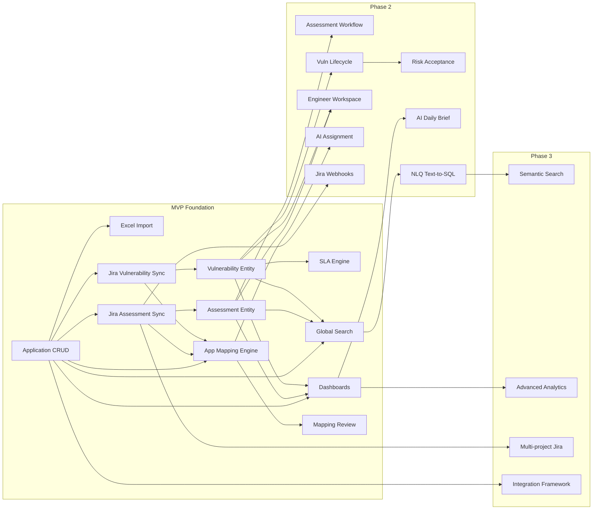

---

# PART AA – Initial Product Backlog

## EPIC 1: Asset Inventory

### Feature 1.1: Application Management

**US-1.1.1:** As a Security Administrator, I want to create a new application record so that I can register applications that need security oversight.
- **Acceptance Criteria:**
  - Can fill in application name, ID, business unit, criticality, owners, and other metadata
  - Application ID must be unique
  - Validation prevents saving invalid data
  - Created application appears in the application list
  - Audit log records the creation
- **Priority:** P0
- **Dependencies:** None

**US-1.1.2:** As a Security Manager, I want to view a list of all applications with filtering and sorting so that I can find and review applications.
- **Acceptance Criteria:**
  - Paginated list showing key fields (name, BU, criticality, vuln count, assessment status)
  - Filter by: status, criticality, BU, internet-facing, assessment status, has open vulns
  - Sort by any column
  - Search by name or alias
  - Quick view filters: "Never Assessed", "Assessment Overdue", "Has Critical Vulns"
- **Priority:** P0
- **Dependencies:** US-1.1.1

**US-1.1.3:** As a Security Engineer, I want to view an application's 360-degree security view so that I can understand its complete security posture before starting an assessment.
- **Acceptance Criteria:**
  - Overview tab: metadata, owners, criticality, classification
  - Assessment section: last assessment, next due, history, overdue flag
  - Vulnerability section: counts by severity, SLA status, open/total
  - Timeline tab: chronological security events
  - Jira tab: related external tickets
  - AI summary (when enabled): generated security posture summary
- **Priority:** P0
- **Dependencies:** US-1.1.1, Jira sync features

**US-1.1.4:** As a Security Administrator, I want to manage application aliases so that the system can match tickets that use alternative names.
- **Acceptance Criteria:**
  - Add/remove aliases from application detail page
  - Aliases are normalized (lowercase, trimmed) for matching
  - Duplicate alias for same app is prevented
  - Alias across different apps generates a warning
  - Source of alias is tracked (manual, import, AI-learned)
- **Priority:** P0
- **Dependencies:** US-1.1.1

### Feature 1.2: Excel Import

**US-1.2.1:** As a Security Administrator, I want to upload an Excel file containing the application inventory so that the system can update application information without losing historical data.
- **Acceptance Criteria:**
  - Accept .xlsx files up to 50MB
  - Validate file format and structure before processing
  - Show upload progress
  - Reject non-xlsx files with clear error message
  - Store original file for audit
- **Priority:** P0
- **Dependencies:** US-1.1.1

**US-1.2.2:** As a Security Administrator, I want to map Excel columns to application fields so that the system understands the file structure.
- **Acceptance Criteria:**
  - Display Excel column headers and sample data
  - Dropdown to map each column to an internal field
  - Required fields (name, ID) must be mapped
  - Save column mapping for reuse with future uploads
  - Auto-detect mapping from previously saved templates
- **Priority:** P0
- **Dependencies:** US-1.2.1

**US-1.2.3:** As a Security Administrator, I want to preview import changes before confirming so that I can verify the import is correct.
- **Acceptance Criteria:**
  - Summary: counts for NEW, UPDATED, UNCHANGED, INVALID, DUPLICATE, REMOVED
  - Table showing each row with its status and color coding
  - Expandable row detail showing field-level changes (old value → new value)
  - Validation errors displayed per row with clear messages
  - Ability to exclude specific rows from import
  - REMOVED rows are flagged but not auto-deleted
- **Priority:** P0
- **Dependencies:** US-1.2.2

**US-1.2.4:** As a Security Administrator, I want to confirm and execute the import so that approved changes are applied to the database.
- **Acceptance Criteria:**
  - Changes applied in a database transaction (all or nothing)
  - New applications created, existing applications updated
  - Audit log records all changes with before/after values
  - Import report generated (viewable + downloadable)
  - Import history accessible from admin panel
- **Priority:** P0
- **Dependencies:** US-1.2.3

## EPIC 2: Jira Integration

### Feature 2.1: Jira Assessment Synchronization

**US-2.1.1:** As a Security Administrator, I want to configure the Jira connection so that the platform can synchronize assessment data.
- **Acceptance Criteria:**
  - Configure Jira URL, authentication (API token or OAuth)
  - Specify project key(s) to synchronize
  - Configure JQL filter for assessment issues
  - Test connection button with success/failure feedback
  - Save configuration (credentials stored securely)
- **Priority:** P0
- **Dependencies:** None

**US-2.1.2:** As a system, I want to synchronize assessment tickets from Jira on a schedule so that the platform has up-to-date assessment data.
- **Acceptance Criteria:**
  - Scheduled sync runs every 15 minutes (configurable)
  - Incremental sync: only fetches issues updated since last sync
  - Handles pagination (> 100 issues)
  - Respects Jira API rate limits (backoff on 429)
  - Retries on transient errors (up to 3 times)
  - Records sync history (start time, end time, counts, errors)
  - Alerts on sync failure (after max retries exhausted)
- **Priority:** P0
- **Dependencies:** US-2.1.1

**US-2.1.3:** As a Security Administrator, I want to trigger a manual Jira sync so that I can get immediate updates when needed.
- **Acceptance Criteria:**
  - Manual sync button on integration status page
  - Shows sync progress and result
  - Cannot trigger if a sync is already running
- **Priority:** P0
- **Dependencies:** US-2.1.2

**US-2.1.4:** As a Security Administrator, I want to configure field mapping between Jira and internal fields so that the sync correctly translates Jira data.
- **Acceptance Criteria:**
  - Map Jira fields (including custom fields) to internal assessment fields
  - Map Jira statuses to internal assessment statuses
  - Map Jira issue types / labels to assessment types
  - Unmapped fields stored in ExternalIssue.custom_fields
  - Field mapping changes are audited
- **Priority:** P0
- **Dependencies:** US-2.1.1

### Feature 2.2: Jira Vulnerability Synchronization

**US-2.2.1:** As a system, I want to synchronize vulnerability tickets from Jira so that the platform tracks all security findings.
- **Acceptance Criteria:**
  - Same sync mechanics as assessment sync (incremental, scheduled, retry)
  - Maps Jira severity/priority to internal severity
  - Automatically calculates SLA based on severity + applicable rules
  - Links vulnerability to source assessment if identifiable
  - Triggers application resolution for each synced vulnerability
- **Priority:** P0
- **Dependencies:** US-2.1.1, SLA engine

## EPIC 3: Application Mapping

### Feature 3.1: Application Resolution Engine

**US-3.1.1:** As a system, I want to automatically resolve which application a Jira ticket belongs to so that assessments and vulnerabilities are correctly linked.
- **Acceptance Criteria:**
  - Deterministic matching: exact ID, exact name, exact alias, component mapping
  - Fuzzy matching: normalized string similarity
  - AI matching: LLM analysis for ambiguous cases
  - Each match includes: confidence score, evidence, match method
  - Auto-link at ≥ 90% confidence with deterministic evidence
  - Queue for human review at < 90% confidence
  - Record all mapping decisions in ApplicationMapping
- **Priority:** P0
- **Dependencies:** US-1.1.4, US-2.1.2

**US-3.1.2:** As a Security Engineer, I want to review and confirm application mappings so that incorrect AI matches are corrected.
- **Acceptance Criteria:**
  - Mapping review queue showing unresolved mappings
  - For each mapping: ticket summary, AI suggestion with confidence, evidence, alternatives
  - Actions: Confirm suggestion, Select different application, Mark as no match, Create new alias
  - Confirmed mappings update the assessment/vulnerability application link
  - New aliases are learned for future matching
- **Priority:** P0
- **Dependencies:** US-3.1.1

## EPIC 4: SLA Management

### Feature 4.1: SLA Engine

**US-4.1.1:** As a Security Administrator, I want to configure SLA rules by severity so that vulnerability due dates are calculated automatically.
- **Acceptance Criteria:**
  - Configure default SLA days for each severity level
  - Rules stored in database, changeable via admin UI
  - New rules take effect for newly created vulnerabilities
  - Existing vulnerabilities retain their original SLA
  - Rule changes are audited
- **Priority:** P0
- **Dependencies:** None

**US-4.1.2:** As a system, I want to calculate and track SLA status for all open vulnerabilities so that SLA breaches are detected.
- **Acceptance Criteria:**
  - Hourly SLA recalculation job
  - SLA statuses: on_track, at_risk (≤ 3 days), breached
  - Due date calculated from created_date + applicable SLA days
  - Overdue days calculated for breached vulnerabilities
  - SLA status visible on vulnerability list, detail, and dashboards
- **Priority:** P0
- **Dependencies:** US-4.1.1, Vulnerability entity

**US-4.1.3:** As a Security Manager, I want to receive alerts when vulnerabilities are approaching or have breached SLA so that I can take action.
- **Acceptance Criteria:**
  - In-app notification when vulnerability SLA status changes to at_risk or breached
  - Notification sent to: vulnerability assignee, fix owner, application owner
  - Notifications are deduplicated (one alert per status change, not per check cycle)
- **Priority:** P0
- **Dependencies:** US-4.1.2, Notification system

## EPIC 5: Dashboards

### Feature 5.1: Executive Dashboard

**US-5.1.1:** As a Security Manager, I want to view an executive dashboard so that I can understand the overall security posture at a glance.
- **Acceptance Criteria:**
  - KPI cards: Total Apps, Assessment Coverage %, Open Vulns, Critical Open, SLA Compliance %
  - Vulnerability trend chart (12 months, by severity)
  - Assessment coverage chart (assessed vs not, by BU or criticality)
  - SLA compliance trend (monthly)
  - Top risk applications table
  - Filters: date range, business unit
  - All charts drill down to underlying data
- **Priority:** P0
- **Dependencies:** Application, Assessment, Vulnerability, SLA data

### Feature 5.2: Operations Dashboard

**US-5.2.1:** As a Security Manager, I want to view an operations dashboard so that I can manage day-to-day security team activities.
- **Acceptance Criteria:**
  - KPIs: Assessment backlog, Waiting assignment, In progress, New vulns (this week), SLA breaches, Approaching SLA
  - Assessment by status chart
  - Workload by engineer chart
  - Overdue assessments table
  - New vulnerability severity distribution
  - SLA breach trend
- **Priority:** P0
- **Dependencies:** Assessment, Vulnerability data

## EPIC 6: Platform Foundation

### Feature 6.1: Authentication

**US-6.1.1:** As a user, I want to log in via corporate SSO so that I don't need a separate password.
- **Acceptance Criteria:**
  - OIDC integration with corporate identity provider
  - First-time login creates user account
  - Session managed with secure httpOnly cookies
  - 8-hour session timeout, 30-minute idle timeout
  - Logout clears session
- **Priority:** P0
- **Dependencies:** Corporate SSO availability

### Feature 6.2: RBAC

**US-6.2.1:** As a System Administrator, I want to assign roles to users so that they have appropriate access levels.
- **Acceptance Criteria:**
  - Predefined roles: System Admin, Security Admin, Security Manager, Security Engineer, Application Owner, Developer, Auditor, Executive, Read-Only
  - Each role has defined permissions per the permission matrix
  - API enforces permissions on every request
  - Unauthorized access returns 403 with clear message
- **Priority:** P0
- **Dependencies:** US-6.1.1

### Feature 6.3: Audit Logging

**US-6.3.1:** As an Auditor, I want all significant actions to be logged so that I can review the audit trail for compliance.
- **Acceptance Criteria:**
  - Logged events: login, import, sync, entity CRUD, status changes, mappings, AI decisions, config changes, permission changes
  - Each log entry: timestamp, user, action, entity, details, IP
  - Audit logs are append-only (no modification or deletion)
  - Search/filter audit logs by date, user, action, entity
  - Export audit logs to CSV
- **Priority:** P0
- **Dependencies:** None

## EPIC 7: AI Capabilities

### Feature 7.1: AI Ticket Analysis

**US-7.1.1:** As a Security Engineer, I want AI to analyze Jira tickets and provide a structured summary so that I can quickly understand assessment requests.
- **Acceptance Criteria:**
  - AI analyzes: title, description, labels, components, metadata
  - Output: summary, likely application, assessment type, complexity, required skills, missing info
  - Analysis shown on assessment detail page
  - Analysis recorded in AIRecommendation table
  - Jira description treated as untrusted input (prompt injection protection)
- **Priority:** P0
- **Dependencies:** Assessment sync, AI gateway

### Feature 7.2: Basic Natural Language Query

**US-7.2.1:** As a Security Manager, I want to ask questions about security data in natural language so that I can get quick answers without building reports.
- **Acceptance Criteria:**
  - Chat-like interface for asking questions
  - Common questions mapped to predefined metrics (accurate, fast)
  - Answers include: result, source/methodology, data period, last sync time
  - User can click "View Query" to see how the answer was calculated
  - Permission-aware: user only sees data they're authorized for
  - Questions and answers logged to AI audit trail
- **Priority:** P0 (predefined metrics only; Text-to-SQL in Phase 2)
- **Dependencies:** Dashboard metrics

---

# PART AB – Risks and Open Issues

## Product Risks

| Risk | Likelihood | Impact | Mitigation |
|------|-----------|--------|------------|
| Users resist adopting a new platform over familiar tools (Excel + Jira) | High | High | Demonstrate clear value from day one; ensure platform is faster than manual process; don't replace Jira but augment it |
| Application inventory in Excel is incomplete or inaccurate | High | High | Import validation catches data quality issues; treat first import as baseline, improve iteratively |
| Scope creep delays MVP | Medium | High | Strict MVP boundary; defer non-essential features; weekly prioritization review |
| Dashboard metrics don't match management expectations | Medium | Medium | Validate metric definitions with stakeholders early; show calculation methodology |

## Technical Risks

| Risk | Likelihood | Impact | Mitigation |
|------|-----------|--------|------------|
| Jira API limitations (rate limits, missing fields) | Medium | High | Design for rate limits from the start; identify required custom fields early; test API access before development |
| PostgreSQL FTS insufficient for search quality | Low | Medium | pg_trgm + FTS covers most cases; monitor search quality; OpenSearch migration path documented |
| pgvector performance at scale | Low | Low | MVP scale is well within pgvector limits; migration path to dedicated vector DB documented |
| Next.js server-side complexity | Medium | Medium | Clear separation of API routes and service layer; avoid over-reliance on server components |

## Data Quality Risks

| Risk | Likelihood | Impact | Mitigation |
|------|-----------|--------|------------|
| Application identity resolution accuracy below target | High | High | Multi-signal matching; human review for low confidence; continuous feedback loop; alias learning |
| Jira tickets have inconsistent or missing application references | High | High | AI-assisted resolution; mapping review queue; reporting on unresolved mappings |
| Historical Jira data has poor data quality | Medium | Medium | Validate during sync; allow manual correction; flag incomplete records |
| Duplicate applications created from different sources | Medium | High | Identity resolution pipeline; duplicate detection; merge capability (Phase 2) |

## Integration Risks

| Risk | Likelihood | Impact | Mitigation |
|------|-----------|--------|------------|
| Jira API access may require lengthy approval process | Medium | High | Start API access request immediately; develop with Jira mock server initially |
| Jira project configuration may not match assumptions | Medium | Medium | Early discovery of Jira project structure, workflows, custom fields |
| Corporate SSO configuration delays | Medium | High | Implement basic auth fallback for development; engage IT early |
| LLM API availability / latency issues | Low | Medium | Graceful degradation (deterministic matching still works); retry logic; AI operations are non-blocking |

## Security Risks

| Risk | Likelihood | Impact | Mitigation |
|------|-----------|--------|------------|
| Prompt injection via Jira ticket content | High | Medium | Input isolation; clear prompt structure; output validation |
| SQL injection via NLQ feature | Medium | Critical | Read-only DB user; SQL validation; query allowlist; parameterization |
| XSS via rendered Jira content | High | High | DOMPurify sanitization; CSP headers; React auto-escaping |
| Unauthorized data access via AI | Medium | High | Permission-aware retrieval; scope injection; output validation |

## AI Risks

| Risk | Likelihood | Impact | Mitigation |
|------|-----------|--------|------------|
| AI hallucination in NLQ answers | High | Medium | Predefined metrics for common queries; source citations; SQL validation |
| Low accuracy in application resolution | Medium | High | Multi-signal approach; human review; continuous learning |
| LLM provider API changes or pricing changes | Low | Medium | AI Gateway abstracts provider; model switching is configuration |
| Sensitive data sent to LLM provider | Medium | Medium | Minimize data in prompts; enterprise data agreement; no PII in prompts |

## Operational Risks

| Risk | Likelihood | Impact | Mitigation |
|------|-----------|--------|------------|
| Small team cannot maintain and enhance platform | Medium | High | Modular architecture; good documentation; automated testing; keep scope tight |
| Background job failures go unnoticed | Medium | Medium | Job monitoring dashboard; failure alerts; dead letter queue with investigation |
| Database growth management | Low | Medium | Audit log partitioning; retention policies; monitoring |
| Mapping review queue grows unmanageably | Medium | Medium | Improve AI accuracy; set review queue alerts; batch review UI |

---

# PART AC – Questions for the Product Owner

## Business

1. Who are the primary 3–5 users who will use the platform daily? Can we shadow them to understand their current workflow?
2. What is the expected timeline for MVP delivery? Are there compliance deadlines driving the schedule?
3. Is there an existing budget for LLM API costs (Claude API)? Expected monthly token budget?
4. Who is the executive sponsor for this initiative?
5. Are there other teams (IT, DevOps, Compliance) that should be consulted during design?

## Asset Inventory

6. Does the Excel inventory have a stable Application ID column, or is it name-based only?
7. How frequently does the Excel file change? Daily, weekly, monthly?
8. Who produces the Excel file — is it exported from a CMDB or manually maintained?
9. Is there a CMDB (ServiceNow, etc.) that could be the source of truth instead of Excel?
10. How many applications are currently in the inventory?
11. Are there applications in Jira that are NOT in the Excel inventory?

## Jira

12. Is Jira Cloud or Jira Server/Data Center?
13. Which Jira project(s) contain security assessments? Vulnerability tickets?
14. What issue types are used for assessments vs. vulnerabilities?
15. Are there custom fields for application name, assessment type, severity?
16. What Jira workflows (statuses, transitions) are configured?
17. Can we get Jira admin access for webhook configuration?
18. What is the Jira API rate limit for our account?
19. How many assessment tickets exist historically? Vulnerability tickets?

## Security Assessment

20. What assessment types are currently performed? Is the list in this document complete?
21. What is the expected periodic assessment frequency for different criticality levels?
22. Is there a Go-Live assessment gate today, or is that aspirational?
23. How are assessments currently assigned to engineers?
24. What information does an engineer need before starting an assessment?

## Vulnerability

25. What severity levels are currently used? Do they map cleanly to Critical/High/Medium/Low?
26. Is CVSS scoring used, or just categorical severity?
27. What constitutes a "verified" fix? Who performs verification?
28. Are there existing SLA policies, or are the ones in this document the first formalization?
29. How are risk acceptances currently handled?

## SLA

30. Are the proposed SLA defaults (C:7, H:30, M:60, L:90) aligned with current practice?
31. Should SLA be based on business days or calendar days?
32. Are there application-specific SLA overrides today?
33. What happens when an SLA is breached? Escalation process?

## Workflow

34. Should the platform update Jira ticket statuses, or is Jira the system of record for workflow?
35. When a security engineer completes an assessment in Jira, should the platform auto-update?
36. Is there a formal assessment request intake process today?

## Users and Permissions

37. How many internal users will access the platform?
38. Which SSO provider is used (Azure AD, Okta, etc.)? OIDC or SAML?
39. Are Application Owners and Developers internal or external (vendors)?
40. Do different business units have different access restrictions?

## Security

41. Where will the platform be hosted? On-prem, private cloud, public cloud?
42. Are there specific compliance requirements (ISO 27001, SOC 2, PCI-DSS) that the platform must meet?
43. Is there a security review requirement for the platform itself before go-live?
44. What data classification level applies to the data in this platform?

## Infrastructure

45. Is PostgreSQL 16 available in the hosting environment?
46. Is Redis available or easily provisioned?
47. Is there a container orchestration platform (Kubernetes, ECS)?
48. Is there an existing CI/CD pipeline to integrate with?
49. What monitoring/observability tools are already in use?

## AI

50. Is there an existing enterprise agreement with Anthropic (Claude) or another LLM provider?
51. Are there data residency requirements that restrict where data can be processed?
52. Is there an internal AI governance policy that we need to follow?
53. What is the acceptable latency for AI operations (e.g., ticket analysis)?
54. Should AI features be opt-in or on by default?

## Reporting

55. What reports does management currently receive? How frequently?
56. Are there specific metrics that executives track today?
57. Should dashboards be accessible without login (e.g., on a wall display)?
58. Are there existing BI tools (Power BI, Tableau) that should be integrated?

## Compliance

59. What audit retention period is required (e.g., 2 years, 7 years)?
60. Are there specific regulatory requirements driving this platform?
61. Will external auditors need direct access to the platform?

## Future Integrations

62. Which additional security tools are highest priority for integration after Jira?
63. Is there a vulnerability scanning pipeline today (SAST/DAST/SCA)? Which tools?
64. Is there interest in GitHub/GitLab integration for repository-to-application linking?
65. Is ServiceNow used for IT operations? CMDB?

---

*End of Solution Architecture Document v1.0*

*This document provides the foundation for progressive refinement. Each section can be expanded into detailed specifications as decisions are confirmed and questions are answered.*
